# Integri-TI — Documento Técnico de Arquitectura

> **Versión:** 1.0  
> **Fecha:** 2026-09-24  
> **Autores:** Equipo Integri-TI  
> **Estado:** Hito 1 — Entregable

---

## Tabla de Contenidos

1. [Introducción](#1-introducción)
2. [Requisitos y Manuales](#2-requisitos-y-manuales)
   - 2.1 [Requisitos de Software](#21-requisitos-de-software)
   - 2.2 [Requisitos de Hardware](#22-requisitos-de-hardware)
   - 2.3 [Procedimientos de Instalación y Configuración](#23-procedimientos-de-instalación-y-configuración)
3. [Arquitectura y Diseño (Modelo C4)](#3-arquitectura-y-diseño-modelo-c4)
   - 3.1 [Diagrama de Contexto del Sistema](#31-diagrama-de-contexto-del-sistema)
   - 3.2 [Diagrama de Contenedores](#32-diagrama-de-contenedores)
   - 3.3 [Diagrama de Componentes](#33-diagrama-de-componentes)
   - 3.4 [Diagrama de Código (Módulos Críticos)](#34-diagrama-de-código-módulos-críticos)
4. [Registros de Decisiones Arquitectónicas (ADRs)](#4-registros-de-decisiones-arquitectónicas-adrs)
   - 4.1 [Justificación de Tecnologías Seleccionadas](#41-justificación-de-tecnologías-seleccionadas)
   - 4.2 [Justificación de Algoritmos de Análisis Conductual](#42-justificación-de-algoritmos-de-análisis-conductual)
5. [Datos y Comunicación](#5-datos-y-comunicación)
   - 5.1 [Especificación de Endpoints del Servidor](#51-especificación-de-endpoints-del-servidor)
   - 5.2 [Modelos de Datos y Esquemas de Payload](#52-modelos-de-datos-y-esquemas-de-payload)
   - 5.3 [Protocolos de Comunicación y Seguridad](#53-protocolos-de-comunicación-y-seguridad)
6. [Flujos e Interacción](#6-flujos-e-interacción)
   - 6.1 [Diagramas de Flujo Algorítmico por Módulo](#61-diagramas-de-flujo-algorítmico-por-módulo)
   - 6.2 [Diagramas de Secuencia y Flujo de Datos](#62-diagramas-de-secuencia-y-flujo-de-datos)
7. [Testing](#7-testing)
   - 7.1 [Estrategia Preliminar de Pruebas Unitarias](#71-estrategia-preliminar-de-pruebas-unitarias)

---

## 1. Introducción

**Integri-TI** es una plataforma de supervisión de integridad académica diseñada para monitorear estaciones de trabajo durante evaluaciones prácticas de programación. El sistema recopila telemetría multiseñal desde cada equipo de alumno y la analiza en un servidor central para detectar infracciones tales como: uso de inteligencia artificial generativa, comunicación entre alumnos, copia de código, uso de dispositivos USB no autorizados y exfiltración de datos.

La arquitectura sigue un modelo **cliente-servidor** con comunicación unidireccional por polling HTTP, donde múltiples agentes de telemetría reportan a un servidor centralizado que ejecuta pipelines de análisis en tiempo real y comparación entre pares de alumnos.

### Objetivos del Sistema

- **Recolección de telemetría multiseñal** en tiempo real desde endpoints heterogéneos (Linux y Windows), cubriendo 7 dimensiones de actividad: procesos activos, tráfico de red, pulsaciones de teclado, dinámicas de tecleo, portapapeles, errores de ejecución y dispositivos USB.
- **Correlación secuencial y temporal** de eventos contra reglas de detección configurables con ventanas de tiempo deslizantes.
- **Comparación multiseñal entre pares de alumnos** para detectar colusión, plagio de código y conductas sincronizadas, utilizando MinHash/LSH para escalabilidad sub-cuadrática.
- **Análisis pedagógico asistido por IA** mediante integración con APIs remotas de modelos de lenguaje (OpenAI, vLLM hospedado u otro proveedor compatible).
- **Panel de control web en tiempo real** para el profesor/administrador, con auditoría forense línea a línea por alumno.

---

## 2. Requisitos y Manuales

### 2.1 Requisitos de Software

#### Agente Cliente

| Componente | Requisito | Observaciones |
|---|---|---|
| **Sistema Operativo** | Linux (Debian/Ubuntu con Xorg) o Windows 10/11 x64 | Wayland debe deshabilitarse en Linux (el instalador lo automatiza) |
| **Python** | ≥ 3.12 (Windows: 3.14 vía py launcher) | Runtime del agente |
| **Npcap** | 1.79 (solo Windows) | Necesario para captura de paquetes de red (modo WinPcap API-compatible) |
| **Paquetes Python** | Según `requirements.txt` | Incluye: `psutil`, `requests`, `pynput`, `scapy`, `scikit-learn`, `numpy`, `wmi` (Win), `pyperclip` |
| **Dependencias de sistema (Linux)** | `build-essential`, `python3-dev`, `libpcap-dev`, `xdotool`, `xclip`, `x11-xserver-utils` | Instaladas automáticamente por `instalar_linux.sh` |
| **Privilegios** | root (Linux) / Administrador (Windows) | Necesario para captura de red, hooks de teclado y acceso a WMI |
| **Servidor gráfico (Linux)** | Xorg (X11) | Requerido para hooks de teclado y captura de ventana activa |

#### Servidor

| Componente | Requisito | Observaciones |
|---|---|---|
| **Sistema Operativo** | Linux, Windows o macOS con Python 3 | Linux recomendado para producción |
| **Python** | ≥ 3.10 | Runtime del servidor |
| **FastAPI + Uvicorn** | Últimas versiones estables | Framework web asíncrono y servidor ASGI |
| **SQLite 3** | Incluido en la librería estándar de Python | Base de datos embebida (`integri_ti.db`) |
| **datasketch** | Para MinHash/LSH del comparador | Algoritmos de similitud sub-cuadrática |
| **httpx** | Cliente HTTP asíncrono | Comunicación con la API de IA |
| **Jinja2** | Motor de templates | Renderizado del dashboard |
| **Puerto de red** | 8000 (TCP) | Debe estar accesible desde los agentes |

#### Componentes Opcionales (AI Insights)

| Componente | Requisito | Observaciones |
|---|---|---|
| **API compatible con OpenAI** | OpenAI, vLLM hospedado, u otro proveedor compatible | Configurable vía `.env` |
| **Modelo LLM** | `luna`, `gpt-4o` u otro modelo disponible en el proveedor | Configurable vía `OPENAI_MODEL` |
| **Clave de API** | Token de autenticación del proveedor | Variable de entorno `OPENAI_API_KEY` |

### 2.2 Requisitos de Hardware

#### Agente Cliente (Mínimos)

| Recurso | Mínimo | Recomendado |
|---|---|---|
| **CPU** | 2 cores | 4 cores |
| **RAM** | 512 MB disponibles | 1 GB disponibles |
| **Disco** | 100 MB | 500 MB |
| **Red** | Conectividad HTTP al servidor (puerto 8000) | LAN o red local dedicada |
| **Pantalla** | Resolución mínima 1024×768 | Para captura correcta de ventana activa |

> [!NOTE]
> El agente ejecuta 7 módulos de telemetría concurrentes en hilos daemon. El módulo de dinámica de tecleo (SVM) requiere una fase de calibración inicial de ~100 pulsaciones que consume CPU adicional temporalmente. El sniffer de red puede generar tráfico adicional de logs proporcional a la actividad de red del alumno.

#### Servidor

| Recurso | Mínimo | Recomendado |
|---|---|---|
| **CPU** | 2 cores | 8+ cores |
| **RAM** | 2 GB | 8 GB |
| **Disco** | 2 GB | 20 GB+ (según cantidad de alumnos y duración del examen) |
| **Red** | Puerto 8000 accesible, ancho de banda suficiente | Gigabit Ethernet recomendado en red local |

> [!IMPORTANT]
> El comparador multiseñal realiza análisis de complejidad O(N) gracias a LSH, pero la reconstrucción de código y cruce de señales sobre N alumnos puede consumir CPU significativamente durante el análisis de cierre al finalizar el examen.

### 2.3 Procedimientos de Instalación y Configuración

#### 2.3.1 Instalación del Servidor

```bash
# 1. Clonar el repositorio
git clone <repositorio> && cd Integri-TI/Server

# 2. Crear entorno virtual
python3 -m venv venv
source venv/bin/activate    # Linux/macOS
# .\venv\Scripts\Activate   # Windows PowerShell

# 3. Instalar dependencias
pip install fastapi uvicorn jinja2 python-multipart httpx datasketch

# 4. Configurar IA (opcional — requiere acceso a una API de LLM)
cp .env.example .env
# Editar .env:
#   OPENAI_API_KEY=<clave_de_api_del_proveedor>
#   OPENAI_MODEL=luna
#   OPENAI_BASE_URL=https://api.openai.com/v1

# 5. Iniciar el servidor
python main.py
# Servidor disponible en http://0.0.0.0:8000
```

> [!IMPORTANT]
> La base de datos SQLite (`integri_ti.db`) y el directorio `datos_alumnos/` se crean automáticamente en el primer arranque. Las reglas por defecto de `reglas.json` se sincronizan automáticamente a la base de datos.

#### 2.3.2 Instalación del Agente en Linux

```bash
# Ejecutar como root o con sudo
sudo bash instalar_linux.sh
```

**El script automatiza:**
1. Advertencia de reinicio automático al finalizar.
2. Detección del usuario real (`$SUDO_USER`).
3. Creación del directorio seguro `~/.telemetria_global` y configuración de `PYTHONPATH` en `.bashrc` y `.zshrc`.
4. Reparación de permisos en `Client/` y logs de auditoría (`chmod 666`).
5. **Bypass de Wayland → Xorg**: Detecta Debian y fuerza `WaylandEnable=false` en la configuración de GDM3, requisito crítico para que los hooks de teclado y captura de ventanas funcionen correctamente.
6. Creación de entorno virtual Python con `requirements.txt`.
7. Configuración de regla sudoers NOPASSWD para el agente.
8. Creación del servicio systemd de usuario (`integriti.service`) con `Restart=always`, vinculado a `graphical-session.target`.
9. Habilitación, arranque del servicio y **reinicio automático** del equipo.

**Gestión del servicio:**
```bash
systemctl --user status integriti     # Ver estado
systemctl --user stop integriti       # Detener
systemctl --user restart integriti    # Reiniciar
journalctl --user -u integriti -f     # Ver logs en tiempo real
```

#### 2.3.3 Instalación del Agente en Windows

```powershell
# Ejecutar PowerShell como Administrador
.\windows_scripts\instalar.ps1
```

**El script automatiza:**
1. Verificación de privilegios de Administrador.
2. Creación del directorio `%USERPROFILE%\.telemetria_global` y registro persistente de `PYTHONPATH`.
3. **Instalación automática de Npcap 1.79** si no está presente (descarga e instalación interactiva).
4. Creación de entorno virtual con Python 3.14 (`py -3.14 -m venv venv`).
5. Instalación de dependencias desde `requirements.txt`.
6. Creación de **Tarea Programada** `Agente_IntegriTI_<usuario>`:
   - Ejecutable: `pythonw.exe` (sin ventana de consola visible para el alumno).
   - Disparador: Al iniciar sesión del usuario.
   - Privilegios: `RunLevel Highest` (sin diálogo UAC).
   - Configuración: Oculta, sin límite de tiempo, sin detención por batería.
7. Inicio inmediato de la tarea.

**Desinstalación:**
```powershell
.\windows_scripts\desinstalar.ps1
# Detiene y elimina la tarea programada, limpia logs residuales
```

#### 2.3.4 Configuración del Agente

La configuración del agente se realiza editando `Client/config.txt`:

```ini
sync_interval_seconds=15      # Intervalo de sincronización con el servidor
discovery_timeout_seconds=0   # 0 = búsqueda infinita hasta encontrar servidor
server_ip=                    # IP del servidor (vacío = descubrimiento automático en LAN)
```

Cada módulo de telemetría tiene su propio `config.txt` bajo `Client/modules/<módulo>/`:

```ini
# Ejemplo: Client/modules/program_monitor/config.txt
enabled=true
log_file=program_monitor.log
poll_seconds=1.0
log_title_changes=true
```

> [!TIP]
> Los módulos pueden habilitarse/deshabilitarse y reconfigurarse **remotamente** en tiempo real desde el panel web del profesor, tanto de forma global como individual por alumno. Los cambios se entregan al agente en el siguiente ciclo de sincronización `/sync`.

---

## 3. Arquitectura y Diseño (Modelo C4)

### 3.1 Diagrama de Contexto del Sistema

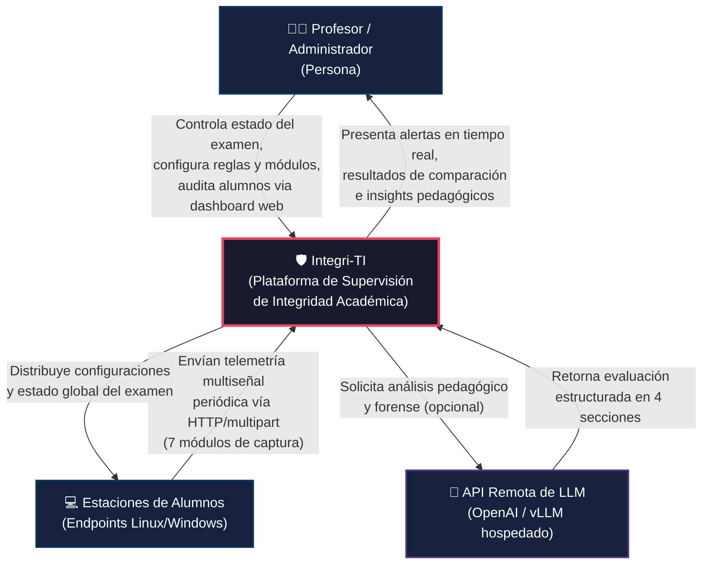

### 3.2 Diagrama de Contenedores

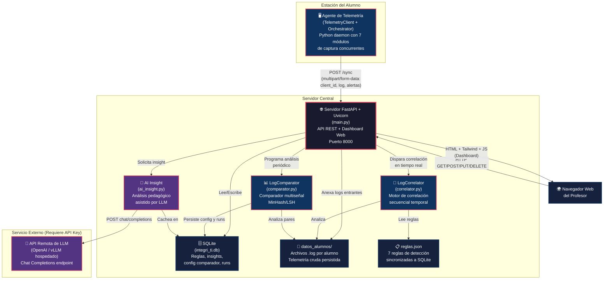

### 3.3 Diagrama de Componentes

#### 3.3.1 Componentes del Agente de Telemetría (Cliente)

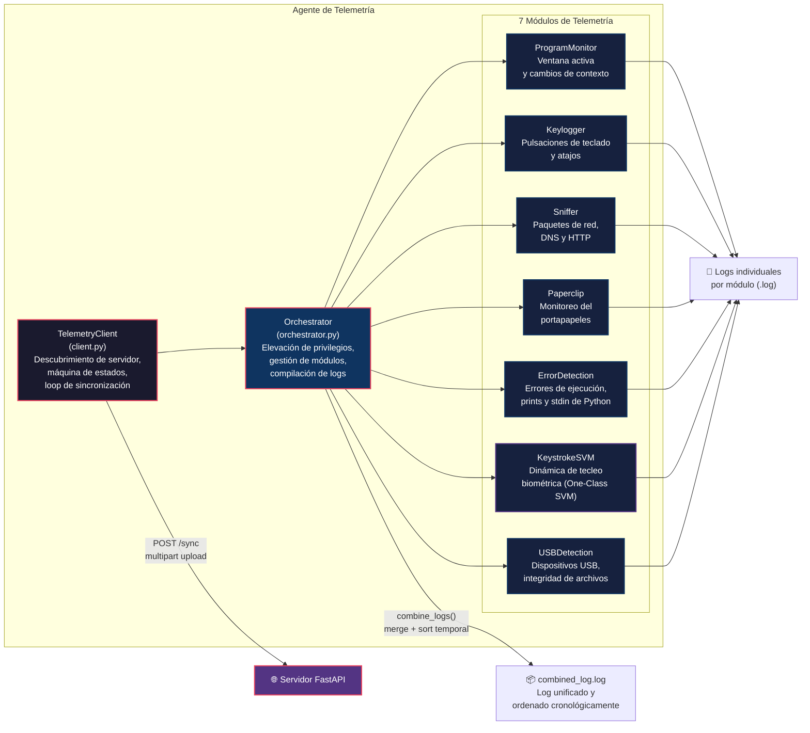

#### 3.3.2 Componentes del Servidor

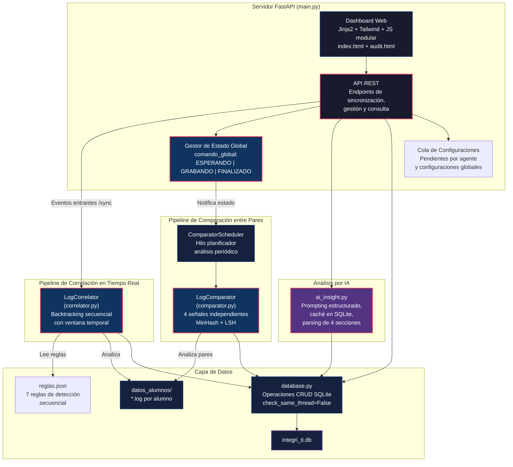

### 3.4 Diagrama de Código (Módulos Críticos)

#### 3.4.1 Estructura de Clases del Cliente

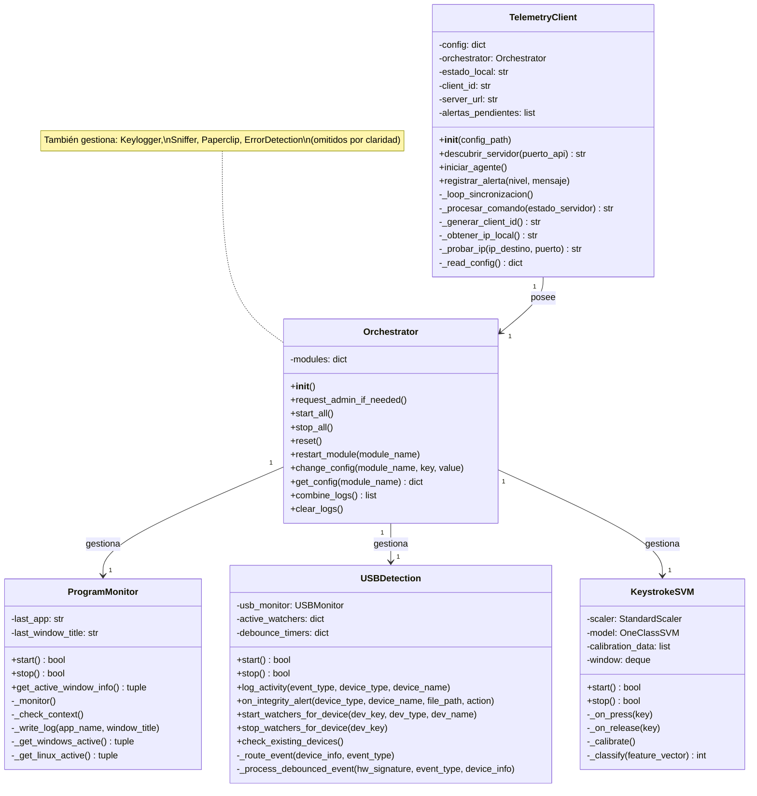

#### 3.4.2 Patrón de Descubrimiento Automático de Servidor

El agente implementa un **mecanismo de descubrimiento automático** que no requiere configuración previa de la dirección IP del servidor:

1. Si `server_ip` está definido en `config.txt`, intenta conexión directa.
2. Si no, escanea la subred local `/24` y rangos estándar de redes privadas (`192.168.0.x`, `192.168.1.x`, `192.168.100.x`) usando `ThreadPoolExecutor(max_workers=100)`.
3. Cada IP candidata es probada contra `GET /api/discovery` con timeout de 0.5s.
4. El servidor solo acepta conexiones si `comando_global == "ESPERANDO"` (HTTP 200); si está en otro estado retorna HTTP 403.

#### 3.4.3 Patrón de Comunicación Desacoplada por Logs

Los 7 módulos de telemetría **no se comunican directamente entre sí**. Cada uno escribe en su propio archivo de log con formato `[{timestamp}][{módulo}] {contenido}`. El `Orchestrator` compila y ordena cronológicamente todos los logs en `combined_log.log`, que se envía al servidor como archivo adjunto en el siguiente ciclo de sincronización. Tras el envío exitoso, todos los archivos de log se truncan a 0 bytes.

---

## 4. Registros de Decisiones Arquitectónicas (ADRs)

### 4.1 Justificación de Tecnologías Seleccionadas

#### ADR-001: Python como lenguaje principal

| Campo | Detalle |
|---|---|
| **Estado** | Aceptada |
| **Contexto** | Se necesita un lenguaje multiplataforma con acceso profundo al sistema operativo para captura de eventos de bajo nivel (teclado, red, procesos, USB, filesystem). |
| **Decisión** | Utilizar **Python ≥ 3.10** tanto para el agente como para el servidor. |
| **Justificación** | (1) Librerías maduras para instrumentación del SO: `psutil`, `pynput`, `scapy`, `wmi`, `ctypes` para inotify/Win32; (2) `scikit-learn` y `numpy` para ML biométrico en el agente; (3) `FastAPI` como framework web moderno con soporte async; (4) `datasketch` para algoritmos de similitud sub-cuadrática; (5) amplia adopción en ciberseguridad y desarrollo rápido. |
| **Consecuencias** | El agente consume más recursos que una implementación en C/Rust, pero el trade-off es aceptable dado el contexto educativo y la riqueza del ecosistema de librerías. Python 3.14 se selecciona para Windows por mejoras de rendimiento en el lanzador `py`. |

#### ADR-002: FastAPI como framework web del servidor

| Campo | Detalle |
|---|---|
| **Estado** | Aceptada |
| **Contexto** | El servidor necesita manejar concurrentemente: recepción de telemetría de múltiples agentes, análisis en tiempo real, API REST para el dashboard, y llamadas asíncronas a APIs de IA. |
| **Decisión** | Utilizar **FastAPI** con **Uvicorn** como servidor ASGI. |
| **Justificación** | (1) Soporte nativo de `async/await` para llamadas HTTP a APIs de IA sin bloquear el event loop; (2) manejo eficiente de `multipart/form-data` para recepción de archivos de log; (3) documentación automática OpenAPI; (4) alto rendimiento comparado con Flask para múltiples conexiones simultáneas; (5) integración natural con `httpx` (cliente async) y `Jinja2` (templates). |
| **Alternativas descartadas** | Flask (sincrónico, peor manejo de I/O concurrente para llamadas a IA), Django (overhead innecesario). |

#### ADR-003: SQLite como base de datos

| Campo | Detalle |
|---|---|
| **Estado** | Aceptada |
| **Contexto** | Se necesita persistencia para reglas, insights de IA, configuración del comparador e historial de ejecuciones, sin requerir infraestructura adicional. |
| **Decisión** | Utilizar **SQLite** con `check_same_thread=False` y `row_factory=sqlite3.Row`. |
| **Justificación** | (1) Zero-config — incluido en la librería estándar de Python; (2) despliegue simplificado (un solo archivo `integri_ti.db`); (3) volumen de datos manejable (decenas de alumnos, exámenes de horas); (4) la telemetría cruda se persiste en archivos `.log` separados, no en la BD, lo que reduce la presión sobre SQLite. |
| **Consecuencias** | La telemetría bruta se almacena en el filesystem (`datos_alumnos/*.log`), no en SQLite, lo cual es una decisión deliberada de diseño para optimizar el rendimiento de escritura y facilitar el análisis de archivos completos por el comparador. |

#### ADR-004: Integración con API remota de LLM compatible con OpenAI

| Campo | Detalle |
|---|---|
| **Estado** | Aceptada |
| **Contexto** | Se desea integrar análisis pedagógico asistido por IA. Se necesita flexibilidad para cambiar de proveedor sin modificar código. |
| **Decisión** | Integrar mediante la **API estándar de Chat Completions** (especificación OpenAI), consumiendo un servicio remoto configurable vía variables de entorno. |
| **Justificación** | (1) Máxima flexibilidad: el mismo código permite conectar a OpenAI (GPT-4o), proveedores alternativos (vLLM hospedado, modelos Luna) o cualquier servicio compatible con la especificación de Chat Completions, solo cambiando `OPENAI_BASE_URL` y `OPENAI_MODEL` en el `.env`; (2) autenticación estándar vía Bearer token; (3) el módulo usa `httpx.AsyncClient` con timeout de 90 segundos para no bloquear el servidor durante la inferencia; (4) caché en SQLite evita llamadas redundantes a la API y costos innecesarios; (5) no requiere hardware especializado (GPU) en el servidor. |
| **Consecuencias** | Requiere conexión a internet o a un servicio de LLM accesible por red. El componente es completamente opcional — si `OPENAI_API_KEY` no está configurado, el sistema funciona sin AI Insights. |

#### ADR-005: Polling HTTP con sincronización multipart

| Campo | Detalle |
|---|---|
| **Estado** | Aceptada |
| **Contexto** | Se necesita un mecanismo de comunicación entre los agentes (estaciones de alumnos) y el servidor del profesor. |
| **Decisión** | Utilizar **HTTP polling** con endpoint `/sync` que acepta `multipart/form-data`, con intervalo configurable de **15 segundos** (por defecto). |
| **Justificación** | (1) Simplicidad: un único endpoint bidireccional (`/sync`) donde el agente envía telemetría y recibe el estado global + configuraciones pendientes; (2) compatibilidad con firewalls y redes corporativas/educativas que bloquean WebSockets; (3) `multipart/form-data` permite enviar el archivo de log combinado junto con metadatos en una sola petición; (4) el intervalo de 15s es adecuado para supervisión de exámenes; (5) tolerancia a pérdida de conexión con reconexión automática (3 reintentos antes de reset y redescubrimiento). |
| **Alternativas descartadas** | WebSockets (complejidad de reconexión, incompatibilidad con proxies educativos), MQTT (requiere broker adicional), gRPC (overhead de setup para el caso de uso). |

#### ADR-006: Tailwind CSS vía CDN para el dashboard

| Campo | Detalle |
|---|---|
| **Estado** | Aceptada |
| **Contexto** | El dashboard web necesita una interfaz oscura, responsiva y profesional sin un pipeline de build frontend. |
| **Decisión** | Utilizar **Tailwind CSS vía CDN** con configuración personalizada inline. |
| **Justificación** | (1) Zero-build: no requiere Node.js, webpack ni npm, simplificando el despliegue; (2) utility-first permite desarrollo rápido de UI; (3) el CDN con configuración de colores de marca (`brand`) y breakpoints personalizados (`xs: 480px`, `3xl: 1920px`) cubre todas las necesidades sin CSS compilado; (4) complementado por una hoja de estilos mínima (`styles.css`) solo para tipografías (Inter + JetBrains Mono), scrollbars y animaciones de pulso. |

### 4.2 Justificación de Algoritmos de Análisis Conductual

#### ADR-007: Correlación secuencial con backtracking temporal

| Campo | Detalle |
|---|---|
| **Estado** | Aceptada |
| **Contexto** | Se necesita detectar secuencias causales de eventos que ocurren en diferentes módulos dentro de una ventana de tiempo acotada (e.g., "el alumno copió al portapapeles, luego abrió un navegador, luego accedió a ChatGPT, luego pegó código"). |
| **Decisión** | Implementar un **motor de correlación por backtracking** que evalúa cadenas de eventos secuenciales multi-módulo contra reglas definidas con patrones regex y ventanas temporales. |
| **Justificación** | (1) Permite modelar infracciones complejas como secuencias de $k$ pasos $[P_0, P_1, \dots, P_k]$, donde cada paso especifica un módulo y un patrón regex; (2) la búsqueda recursiva con poda por ventana temporal ($\Delta t \leq W$ segundos) evita la explosión combinatoria; (3) el mapeo exacto de números de línea en los logs permite la auditoría forense precisa; (4) debouncing de 15 segundos para evitar alertas duplicadas. |
| **Algoritmo** | Para cada regla con pasos $[P_0, \dots, P_k]$ y ventana $W$: se localiza un evento $E_0$ que satisface $P_0$; para cada paso siguiente $P_j$, se exploran eventos posteriores $E_i$ tales que $E_i.ts \geq E_{j-1}.ts$ y $E_i.ts - E_0.ts \leq W$; si se completa toda la cadena, se registra la infracción con $\Delta t = E_k.ts - E_0.ts$ y las líneas afectadas. |

#### ADR-008: Comparación multiseñal con MinHash/LSH

| Campo | Detalle |
|---|---|
| **Estado** | Aceptada |
| **Contexto** | Se necesita comparar los logs de $N$ alumnos para detectar colusión, plagio de código y sincronización de comportamiento, idealmente en tiempo sub-cuadrático. |
| **Decisión** | Implementar un **comparador multiseñal de 4 dimensiones** con filtrado LSH (Locality Sensitive Hashing) para reducir el espacio de búsqueda. |
| **Algoritmo** | El comparador cruza 4 señales independientes: |

**Señal 1 — Similitud de Código (Jaccard sobre MinHash):**
- Reconstruye el código final tecleado por cada alumno emulando una pila de cursor bidireccional (`[BACKSPACE]`, `[LEFT]`, `[RIGHT]`, `[ENTER]`).
- Normaliza: elimina comentarios `#`, espacios redundantes, convierte a minúsculas.
- Extrae $k$-shingles (n-gramas de palabras, $k=5$) y genera firmas `MinHash(num_perm=128)`.
- Indexa en `MinHashLSH(threshold=0.35)` para obtener pares candidatos en tiempo sub-cuadrático.
- Calcula la similitud Jaccard exacta:

$$J(A, B) = \frac{|S_A \cap S_B|}{|S_A \cup S_B|}$$

**Señal 2 — Portapapeles Compartido (SequenceMatcher):**
- Índice invertido de palabras ≥ 5 caracteres para pre-filtrado.
- Comparación por `difflib.SequenceMatcher` con poda por ratio de longitud y `quick_ratio()`.

**Señal 3 — Sincronía de Fugas de Contexto:**
- Reconstruye intervalos de fuga (ventanas fuera de la whitelist: `code`, `python`, `pythonw`, `integri-ti`).
- Detecta si dos alumnos abandonaron el contexto permitido con diferencia $\leq 8$ segundos.
- Verifica si hubo tráfico de red (Sniffer) en ambos extremos durante la fuga.

**Señal 4 — Sincronía de Ejecución:**
- Detecta ejecuciones del mismo script con diferencia $\leq 8$ segundos.
- Compara salidas de consola (`[PRINT]`) por igualdad.

**Score de Riesgo Compuesto:**

$$\text{Score} = 0.45 \times J_{\text{código}} + 0.35 \times \text{Sim}_{\text{clip}} + 0.15 \times \text{Sync}_{\text{fuga}} + 0.05 \times \text{Sync}_{\text{exec}}$$

Con reglas de escalación:
- Si $\text{Sim}_{\text{clip}} \geq 0.85$ y existe ejecución sincronizada: $\text{Score} = \max(\text{Score}, 0.70)$
- Si $\text{Sim}_{\text{clip}} \geq 0.85$: $\text{Score} = \max(\text{Score}, 0.50)$

**Clasificación de severidad:**
- **CRÍTICO:** $\text{Score} \geq 0.55 \lor J \geq 0.65 \lor (\text{Sim}_{\text{clip}} \geq 0.85 \land \text{Sync}_{\text{exec}})$
- **ALTO:** $\text{Score} \geq 0.35 \lor J \geq 0.45 \lor \text{Sim}_{\text{clip}} \geq 0.70$
- **MEDIO:** Cualquier otro par candidato detectado.

#### ADR-009: Dinámica de tecleo con One-Class SVM

| Campo | Detalle |
|---|---|
| **Estado** | Aceptada (integrada como módulo del agente) |
| **Contexto** | Se necesita detectar cambios de operador en la estación de trabajo (e.g., un alumno que cede su equipo a otro para que resuelva el examen). |
| **Decisión** | Implementar un módulo de **autenticación biométrica continua** basado en la dinámica de tecleo, usando un One-Class SVM con kernel RBF. |
| **Vector biométrico bidimensional** | Cada pulsación genera un vector $\mathbf{x} = [\text{flight\_time}, \text{hold\_time}]$: |
| | • **Flight time**: latencia entre pulsaciones consecutivas ($< 1.5$s). |
| | • **Hold time**: tiempo de retención de la tecla ($< 0.5$s). |
| **Pipeline ML** | (1) Calibración con 100 vectores; (2) Normalización con `StandardScaler`; (3) Entrenamiento de `OneClassSVM(nu=0.05, kernel="rbf", gamma="scale")`; (4) Clasificación en tiempo real: `predict()` → $+1$ (normal) o $-1$ (anomalía). |
| **Umbral de alerta** | Ventana móvil de 60 teclas. Si anomalías $\geq 25\%$ (15 de 60), se dispara alerta de posible cambio de operador. |

> [!NOTE]
> Además del SVM, se implementó una prueba de concepto alternativa más simple basada en Z-Score sobre el flight time, con calibración de 50 muestras y umbral de $Z > 2.5$, evaluada sobre ventana móvil de 40 teclas con alerta al 20% de anomalías.

---

## 5. Datos y Comunicación

### 5.1 Especificación de Endpoints del Servidor

#### Endpoints Principales del Agente

| Método | Ruta | Tipo | Descripción |
|---|---|---|---|
| `GET` | `/api/discovery` | Handshake | Compuerta de admisión. Retorna `200` si `comando_global == "ESPERANDO"`, `403` en cualquier otro estado. |
| `POST` | `/sync` | Sincronización | Endpoint principal de comunicación bidireccional agente ↔ servidor. |
| `GET` | `/profesor/comando/{nuevo_comando}` | Control | Cambia el estado global del examen (`ESPERANDO` / `GRABANDO` / `FINALIZADO`). |

#### Endpoints del Dashboard (API REST)

| Método | Ruta | Descripción |
|---|---|---|
| `GET` | `/` | Dashboard principal (`index.html`) |
| `GET` | `/auditoria/{client_id}` | Vista de auditoría forense por alumno (`audit.html`) |
| `GET` | `/api/status` | Estado operativo en tiempo real (clientes, alertas, logs recientes) |
| `POST` | `/api/alertas/limpiar` | Limpia historial de alertas en memoria |

#### Endpoints de Reglas

| Método | Ruta | Request Body | Descripción |
|---|---|---|---|
| `GET` | `/api/reglas` | — | Lista todas las reglas de correlación |
| `POST` | `/api/reglas` | `{nombre, severidad, ventana_segundos, pasos[]}` | Crea/actualiza regla y reanaliza logs existentes |
| `DELETE` | `/api/reglas/{regla_id}` | — | Elimina una regla |
| `POST` | `/api/reglas/reanalizar` | — | Limpia alertas y reejecuta correlación sobre todos los `.log` |

#### Endpoints de Módulos (Configuración Remota)

| Método | Ruta | Query/Body | Descripción |
|---|---|---|---|
| `GET` | `/api/modulos` | `?destino=global\|client_id` | Obtiene configuraciones de todos los módulos |
| `GET` | `/api/modulos/{nombre}` | `?destino=...` | Obtiene configuración de un módulo específico |
| `POST` | `/api/modulos/{nombre}` | `{destino, valores}` | Encola cambios de configuración para el próximo `/sync` |

#### Endpoints de Logs y Auditoría

| Método | Ruta | Descripción |
|---|---|---|
| `GET` | `/api/logs/{client_id}` | Descarga directa del archivo `.log` crudo (text/plain UTF-8) |
| `GET` | `/api/auditoria/{client_id}` | JSON con info del alumno, líneas de log, alertas mapeadas a números de línea |

#### Endpoints de AI Insights

| Método | Ruta | Body | Descripción |
|---|---|---|---|
| `GET` | `/api/insight/{client_id}` | — | Consulta si existe insight previo en caché (SQLite) |
| `POST` | `/api/insight/{client_id}` | `{forzar: bool}` (opt) | Genera insight pedagógico (o retorna de caché). `forzar=true` regenera. |

#### Endpoints del Comparador

| Método | Ruta | Body | Descripción |
|---|---|---|---|
| `GET` | `/api/comparador/config` | — | Configuración y estado del scheduler |
| `POST` | `/api/comparador/config` | `{intervalo_segundos, auto_analisis, k_shingle, ...}` | Actualiza parámetros del comparador |
| `GET` | `/api/comparador/resultados` | — | Último resultado del análisis comparativo |
| `POST` | `/api/comparador/ejecutar` | — | Fuerza ejecución inmediata del comparador |

### 5.2 Modelos de Datos y Esquemas de Payload

#### 5.2.1 Esquema de Base de Datos (SQLite)

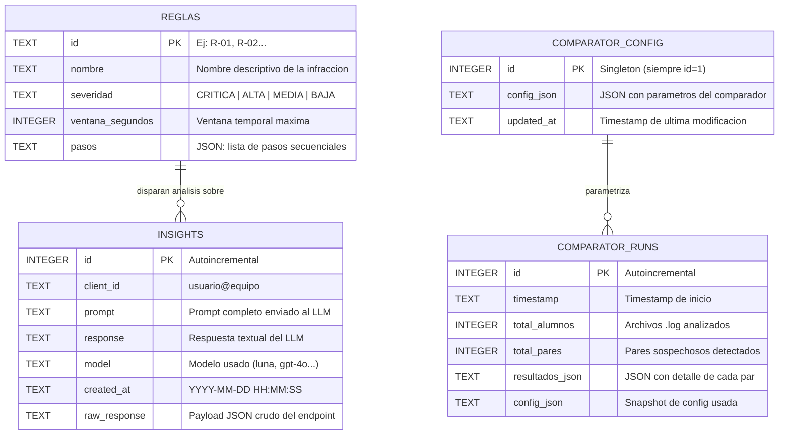

> [!NOTE]
> La telemetría cruda **no se almacena en SQLite**. Se persiste como archivos `.log` individuales por alumno en el directorio `datos_alumnos/`, optimizando el rendimiento de escritura y permitiendo el análisis de archivos completos por los motores de correlación y comparación.

#### 5.2.2 Payload de Sincronización (`POST /sync`)

**Request** — `multipart/form-data`:

| Campo | Tipo | Requerido | Descripción |
|---|---|---|---|
| `client_id` | string (form field) | Sí | Identidad del alumno, formato `usuario@equipo` |
| `estado_local` | string (form field) | Sí | `"ESPERANDO"`, `"GRABANDO"` o `"FINALIZADO"` |
| `timestamp` | string (form field) | Sí | Timestamp ISO del agente `%Y-%m-%dT%H:%M:%S` |
| `alertas` | string (form field) | No | JSON serializado: `[{"timestamp": ..., "nivel": ..., "mensaje": ...}]` |
| `configs` | string (form field) | No | JSON con configuraciones locales del agente |
| `archivo_log` | file (upload) | No | `combined_log.log` — log unificado de todos los módulos |

**Response** — `application/json`:

```json
{
  "comando_global": "GRABANDO",
  "configuraciones": {
    "program_monitor": {"enabled": "true", "poll_seconds": "0.5"},
    "sniffer": {"enabled": "true"}
  }
}
```

#### 5.2.3 Formato de Log de Telemetría

Cada línea del archivo `.log` sigue el formato estandarizado:

```
[{timestamp_ISO}][{Nombre del Módulo}] {contenido_del_evento}
```

**Ejemplos por módulo:**

```log
[2026-09-24T14:30:05][Program Monitor] CONTEXT_CHANGE app='chrome.exe' title='ChatGPT — Google Chrome'
[2026-09-24T14:30:07][Sniffer] DNS Query: chatgpt.com → 104.18.32.7
[2026-09-24T14:30:08][Keylogger] [CTRL]+c
[2026-09-24T14:30:10][Paperclip] CLIPBOARD_CHANGED contenido='def fibonacci(n):...'
[2026-09-24T14:30:12][Keylogger] [CTRL]+v
[2026-09-24T14:30:15][Auditoria Python] [CRASH DETECTADO] NameError: name 'fib' is not defined
[2026-09-24T14:30:20][USB Detection] ALERTA_USB Dispositivo=Pendrive (Kingston DT) | Archivo=E:\respuestas.py | Accion=ARCHIVO CREADO | Proceso=explorer.exe
[2026-09-24T14:30:25][Keystrokes SVM] ANOMALIA distancia=-0.342 anomalias=16/60 (26.7%)
```

#### 5.2.4 Estructura de Reglas de Correlación (`reglas.json`)

```json
[
  {
    "id": "R-01",
    "nombre": "Consulta a IA y Pegado de Código",
    "severidad": "CRÍTICA",
    "ventana_segundos": 60,
    "pasos": [
      {"modulo": "paperclip", "patron": "CLIPBOARD_CHANGED"},
      {"modulo": "program_monitor", "patron": "CONTEXT_CHANGE.*app='(firefox|chrome|msedge)'"},
      {"modulo": "sniffer", "patron": "gemini\\.google\\.com|chatgpt\\.com|claude\\.ai|deepseek"},
      {"modulo": "keylogger", "patron": "\\[CTRL\\]\\+v"}
    ]
  },
  {
    "id": "R-02",
    "nombre": "Copia a Portapapeles y Acceso a IA/Web",
    "severidad": "ALTA",
    "ventana_segundos": 45,
    "pasos": [
      {"modulo": "paperclip", "patron": "CLIPBOARD_CHANGED"},
      {"modulo": "sniffer", "patron": "chatgpt\\.com|gemini\\.google\\.com|claude\\.ai"}
    ]
  },
  {
    "id": "R-03",
    "nombre": "Exfiltración vía Portapapeles a Mensajería",
    "severidad": "ALTA",
    "ventana_segundos": 30,
    "pasos": [
      {"modulo": "paperclip", "patron": "CLIPBOARD_CHANGED"},
      {"modulo": "sniffer", "patron": "discord\\.com|miro\\.com|chat\\.google\\.com|telegram|whatsapp"}
    ]
  },
  {
    "id": "R-04",
    "nombre": "Crash en Código seguido de Búsqueda Externa",
    "severidad": "MEDIA",
    "ventana_segundos": 60,
    "pasos": [
      {"modulo": "error_detection", "patron": "CRASH DETECTADO"},
      {"modulo": "paperclip", "patron": "CLIPBOARD_CHANGED"},
      {"modulo": "program_monitor", "patron": "CONTEXT_CHANGE.*app='(firefox|chrome|msedge)'"},
      {"modulo": "sniffer", "patron": "gemini\\.google\\.com|chatgpt\\.com|claude\\.ai|deepseek"},
      {"modulo": "keylogger", "patron": "\\[CTRL\\]\\+v"}
    ]
  },
  {
    "id": "R-05",
    "nombre": "Desvío a Navegador Externo durante Ejecución",
    "severidad": "MEDIA",
    "ventana_segundos": 30,
    "pasos": [
      {"modulo": "paperclip", "patron": "CLIPBOARD_CHANGED"},
      {"modulo": "program_monitor", "patron": "CONTEXT_CHANGE.*app='(firefox|chrome|msedge)'"},
      {"modulo": "keylogger", "patron": "\\[CTRL\\]\\+v"}
    ]
  },
  {
    "id": "R-06",
    "nombre": "Acceso a Dispositivo USB o Celular",
    "severidad": "CRÍTICA",
    "ventana_segundos": 60,
    "pasos": [
      {"modulo": "usb_detection", "patron": "ALERTA_USB"}
    ]
  },
  {
    "id": "R-07",
    "nombre": "Copia de Archivo desde USB y Pegado de Código",
    "severidad": "CRÍTICA",
    "ventana_segundos": 60,
    "pasos": [
      {"modulo": "usb_detection", "patron": "ALERTA_USB"},
      {"modulo": "keylogger", "patron": "\\[CTRL\\]\\+v"}
    ]
  }
]
```

#### 5.2.5 Parámetros del Comparador Multiseñal

| Parámetro | Default | Rango | Descripción |
|---|---|---|---|
| `intervalo_segundos` | `60` | $\geq 0$ | Frecuencia de ejecución automática |
| `auto_analisis` | `true` | bool | Habilita scheduler en background |
| `k_shingle` | `5` | 1–20 | Tamaño del n-grama para MinHash |
| `num_perm` | `128` | 16–512 | Permutaciones MinHash (precisión vs memoria) |
| `ventana_sincronia_seg` | `8` | 1–120 | Margen temporal para sincronía de fugas/ejecuciones |
| `umbral_codigo` | `0.35` | 0.0–1.0 | Umbral Jaccard para LSH |
| `umbral_portapapeles` | `0.50` | 0.0–1.0 | Umbral de similitud para portapapeles |
| `apps_permitidas` | `"code, python, pythonw"` | CSV | Whitelist de ejecutables durante el examen |
| `titulos_permitidos` | `"integri-ti"` | CSV | Whitelist de palabras en títulos de ventana |

### 5.3 Protocolos de Comunicación y Seguridad

#### 5.3.1 Protocolo de Comunicación

| Aspecto | Especificación |
|---|---|
| **Protocolo de transporte** | HTTP/1.1 |
| **Formato del payload de telemetría** | `multipart/form-data` (campos de texto + archivo de log) |
| **Formato de respuestas API** | `application/json` |
| **Patrón de comunicación** | Polling (cliente → servidor) cada 15 segundos (configurable) |
| **Puerto** | 8000 (TCP) |
| **Descubrimiento** | Escaneo automático de subred con `ThreadPoolExecutor(max_workers=100)` |
| **Tolerancia a fallos** | 3 reintentos fallidos consecutivos → reset + redescubrimiento de servidor |
| **Dashboard: polling** | El frontend JavaScript refresca estado cada 2 segundos via `GET /api/status` |

#### 5.3.2 Flujo de Comunicación del Agente

```
┌─────────────────────┐              ┌─────────────────────────┐
│  Agente (Alumno)     │              │   Servidor (Profesor)    │
└──────────┬──────────┘              └────────────┬────────────┘
           │                                      │
           │  GET /api/discovery                   │
           │────────────────────────────────────> │
           │                                      │
           │  200 OK {status: "ready"}            │  (o 403 si no ESPERANDO)
           │ <────────────────────────────────────│
           │                                      │
           │  ┌──── Ciclo cada 15s ─────┐         │
           │  │                         │         │
           │  │  POST /sync             │         │
           │  │  multipart/form-data:   │         │
           │  │  • client_id            │         │
           │  │  • estado_local         │         │
           │  │  • timestamp            │         │
           │  │  • alertas (JSON)       │         │
           │  │  • archivo_log (file)   │         │
           │  │─────────────────────────────────> │
           │  │                         │         │──> Anexar a datos_alumnos/{id}.log
           │  │                         │         │──> Correlator: evaluar reglas
           │  │                         │         │──> Generar alertas si match
           │  │                         │         │
           │  │  200 OK                 │         │
           │  │  {comando_global,       │         │
           │  │   configuraciones}      │         │
           │  │ <─────────────────────────────────│
           │  │                         │         │
           │  │  (aplica configs,       │         │
           │  │   transiciona estado)   │         │
           │  │                         │         │
           │  └─────────────────────────┘         │
           │                                      │
           │  Si FINALIZADO:                      │
           │  POST /sync (último log)             │
           │────────────────────────────────────> │
           │  Reset + volver a discovery          │──> Comparador: análisis de cierre
           │                                      │
```

#### 5.3.3 Mecanismos de Seguridad

| Aspecto | Estado Actual | Descripción |
|---|---|---|
| **Control de admisión** | ✅ Implementado | `/api/discovery` rechaza conexiones (HTTP 403) si el examen ya inició (`GRABANDO`) o finalizó (`FINALIZADO`) |
| **Ejecución sigilosa (Windows)** | ✅ Implementado | El agente usa `pythonw.exe` + tarea programada oculta. No hay ventana de consola visible para el alumno |
| **Persistencia ante reinicios** | ✅ Implementado | Servicio systemd (Linux) y tarea programada AtLogOn (Windows) |
| **Privilegios elevados** | ✅ Implementado | Elevación automática UAC (Windows) y sudo NOPASSWD (Linux) |
| **Bypass Wayland** | ✅ Implementado | El instalador de Linux fuerza Xorg para permitir captura de eventos globales |
| **CORS** | ⚠️ Permisivo | `allow_origins=["*"]` — aceptable en red local de aula |
| **Autenticación del dashboard** | ❌ No implementada | Sin login para el panel del profesor |
| **Cifrado en tránsito** | ❌ No implementado | HTTP plano (diseñado para LANs educativas aisladas) |
| **Autenticación de agentes** | ❌ No implementada | Cualquier equipo en la red puede conectarse como agente |
| **API de IA** | ✅ Implementado | Autenticación Bearer Token cargada desde `.env` |

> [!CAUTION]
> El sistema está diseñado para operar en **redes locales de aula aisladas**. Si se despliega en redes abiertas o a través de internet, se debe implementar HTTPS con certificados TLS, autenticación del dashboard, y registro de agentes con pre-autorización.

---

## 6. Flujos e Interacción

### 6.1 Diagramas de Flujo Algorítmico por Módulo

#### 6.1.1 Flujo del Agente de Telemetría (Máquina de Estados)

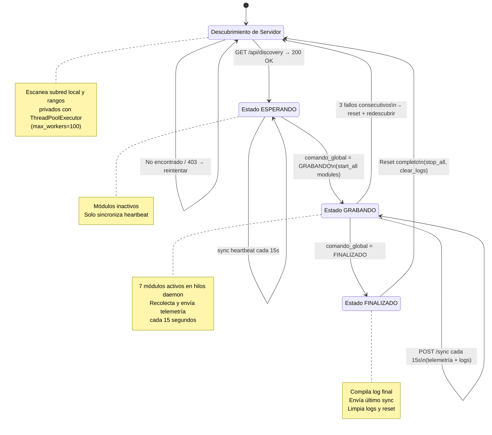

#### 6.1.2 Flujo del Program Monitor

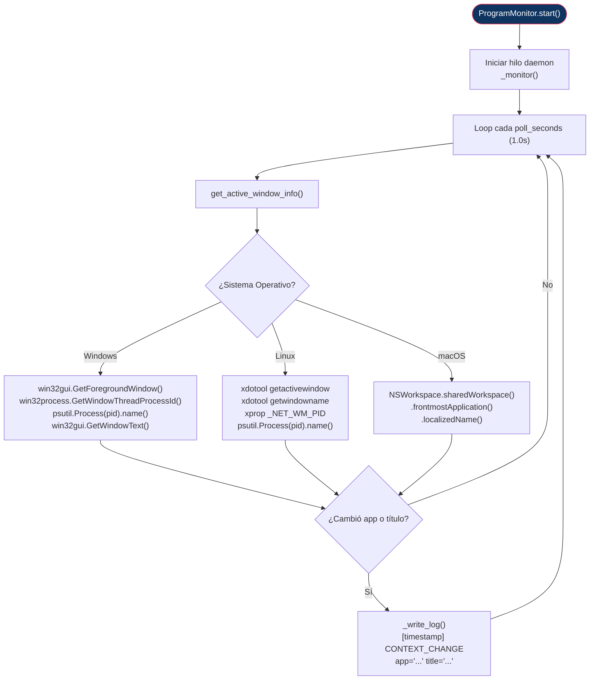

#### 6.1.3 Flujo del USB Detection

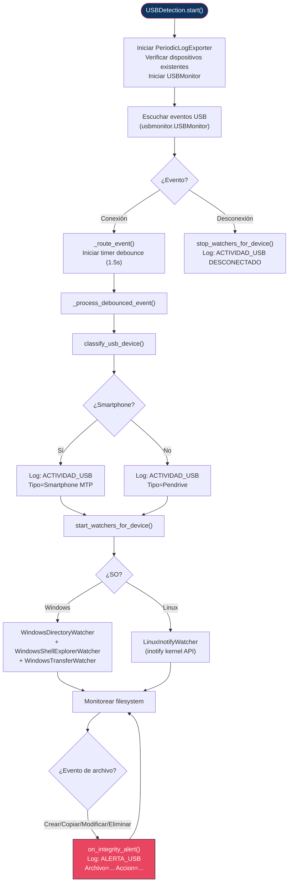

#### 6.1.4 Flujo del Motor de Correlación (Servidor)

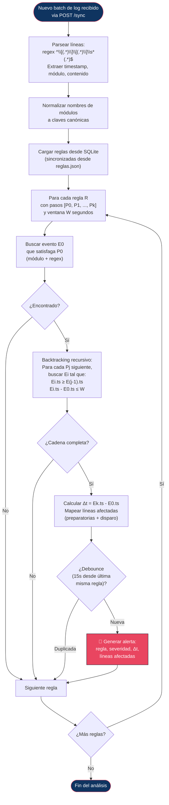

#### 6.1.5 Flujo del Comparador Multiseñal (Servidor)

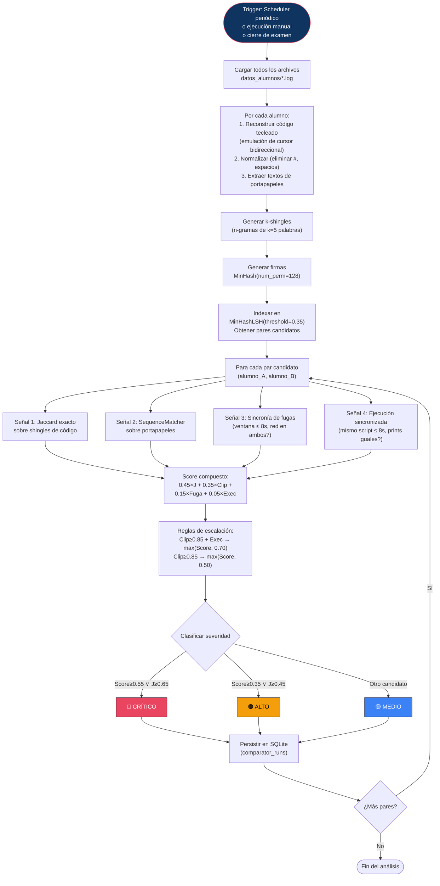

### 6.2 Diagramas de Secuencia y Flujo de Datos

#### 6.2.1 Secuencia Completa: Ciclo de Vida de un Examen

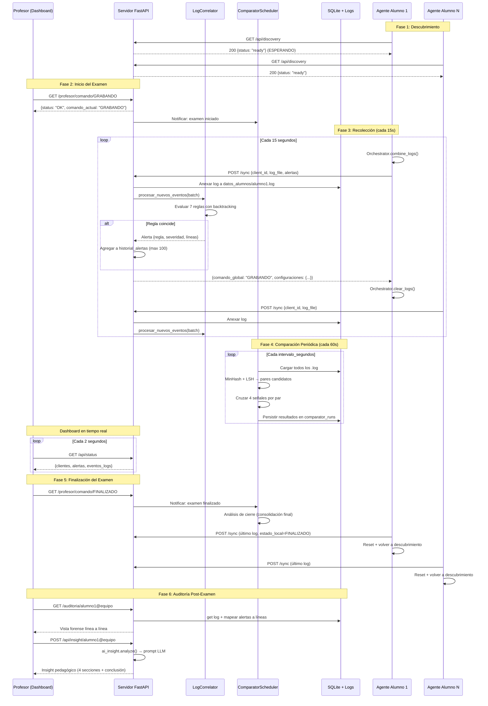

#### 6.2.2 Flujo de Datos Completo del Sistema

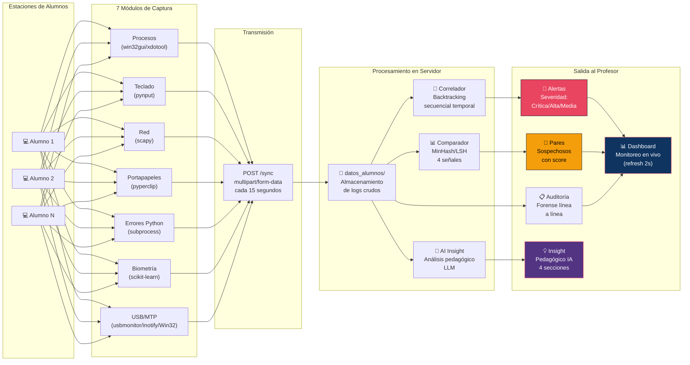

---

## 7. Testing

### 7.1 Estrategia Preliminar de Pruebas Unitarias

#### 7.1.1 Alcance

Las pruebas unitarias se enfocan en los componentes más críticos del sistema: la **recolección y transmisión de datos de telemetría** (cliente), y los **motores de análisis** (servidor).

#### 7.1.2 Framework y Herramientas

| Herramienta | Propósito |
|---|---|
| `pytest` | Framework de pruebas |
| `pytest-asyncio` | Tests de endpoints FastAPI asíncronos |
| `pytest-cov` | Cobertura de código |
| `unittest.mock` | Simulación de dependencias (red, SO, DB, USB) |
| `httpx` (TestClient) | Cliente de pruebas para endpoints FastAPI |

#### 7.1.3 Matriz de Pruebas

##### Módulos del Cliente

| Componente | Test Case | Tipo |
|---|---|---|
| **ProgramMonitor** | `test_context_change_logs_correctly` — Verificar que un cambio de ventana activa genera una línea `CONTEXT_CHANGE` en el log | Unitaria |
| **ProgramMonitor** | `test_no_log_on_same_window` — Sin cambio de ventana, no se escribe log | Unitaria |
| **ProgramMonitor** | `test_cross_platform_dispatch` — `get_active_window_info()` despacha al método del SO correcto | Unitaria |
| **USBDetection** | `test_device_connected_event_logged` — Conexión USB genera `ACTIVIDAD_USB CONECTADO` | Unitaria |
| **USBDetection** | `test_debounce_prevents_duplicate` — Eventos dentro de `cooldown_seconds` se ignoran | Unitaria |
| **USBDetection** | `test_file_alert_on_create` — Creación de archivo en USB genera `ALERTA_USB` con `Accion=ARCHIVO CREADO` | Unitaria |
| **USBDetection** | `test_smartphone_classification` — `classify_usb_device()` identifica correctamente MTP vs Pendrive | Unitaria |
| **KeystrokeSVM** | `test_calibration_phase` — 100 vectores completan la fase de calibración | Unitaria |
| **KeystrokeSVM** | `test_anomaly_detection` — Vector fuera de distribución retorna predict=-1 | Unitaria |
| **KeystrokeSVM** | `test_alert_on_threshold` — 15+ anomalías en ventana de 60 dispara alerta | Unitaria |
| **Orchestrator** | `test_combine_logs_sorted` — `combine_logs()` produce archivo ordenado cronológicamente | Unitaria |
| **Orchestrator** | `test_clear_logs_truncates` — `clear_logs()` trunca todos los archivos a 0 bytes | Unitaria |
| **Orchestrator** | `test_change_config_restarts_module` — Cambio de config triggerea restart del módulo | Unitaria (mock) |
| **TelemetryClient** | `test_discovery_finds_server` — Descubrimiento automático localiza servidor en subred (mock) | Unitaria (mock) |
| **TelemetryClient** | `test_sync_sends_multipart` — `/sync` envía los campos y archivo correctos | Unitaria (mock) |
| **TelemetryClient** | `test_3_failures_triggers_reset` — 3 fallos consecutivos causan reset y redescubrimiento | Unitaria (mock) |

##### Motores de Análisis del Servidor

| Componente | Test Case | Tipo |
|---|---|---|
| **Correlator** | `test_single_step_rule_match` — Regla de 1 paso (R-06: USB) dispara ante `ALERTA_USB` | Unitaria |
| **Correlator** | `test_multi_step_rule_within_window` — Regla de 4 pasos (R-01) dispara cuando la cadena ocurre dentro de la ventana | Unitaria |
| **Correlator** | `test_multi_step_rule_outside_window` — Misma cadena fuera de ventana NO dispara | Unitaria |
| **Correlator** | `test_debounce_prevents_duplicate_alert` — Misma regla no dispara 2 veces en 15s | Unitaria |
| **Correlator** | `test_line_mapping_accuracy` — Números de línea afectadas coinciden con la posición real en el log | Unitaria |
| **Comparator** | `test_code_reconstruction_backspace` — `[BACKSPACE]` elimina correctamente el carácter anterior | Unitaria |
| **Comparator** | `test_code_reconstruction_cursor` — `[LEFT]`/`[RIGHT]` mueven cursor correctamente | Unitaria |
| **Comparator** | `test_minhash_identical_texts` — Textos idénticos producen Jaccard ≈ 1.0 | Unitaria |
| **Comparator** | `test_minhash_different_texts` — Textos completamente diferentes producen Jaccard ≈ 0.0 | Unitaria |
| **Comparator** | `test_lsh_candidate_pairs` — LSH retorna pares de textos similares como candidatos | Unitaria |
| **Comparator** | `test_clipboard_similarity` — SequenceMatcher detecta portapapeles compartido | Unitaria |
| **Comparator** | `test_sync_fuga_detection` — Dos fugas de contexto con $\Delta t \leq 8s$ son detectadas | Unitaria |
| **Comparator** | `test_score_calculation` — Score compuesto con pesos 0.45/0.35/0.15/0.05 es correcto | Unitaria |
| **Comparator** | `test_escalation_rules` — Reglas de escalación modifican el score correctamente | Unitaria |
| **Comparator** | `test_severity_classification` — Score ≥ 0.55 → CRÍTICO, ≥ 0.35 → ALTO, otro → MEDIO | Unitaria |

##### Capa de Datos y API

| Componente | Test Case | Tipo |
|---|---|---|
| **Database** | `test_create_and_get_rule` — CRUD completo de reglas en SQLite | Integración |
| **Database** | `test_store_and_get_insight` — Persistencia y recuperación de insights | Integración |
| **Database** | `test_comparator_config_singleton` — Solo existe un registro id=1 | Integración |
| **Database** | `test_sync_rules_from_json` — Sincronización idempotente desde `reglas.json` | Integración |
| **API** | `test_sync_endpoint_accepts_multipart` — `/sync` acepta correctamente `multipart/form-data` | Integración |
| **API** | `test_discovery_returns_ready` — `/api/discovery` retorna 200 cuando ESPERANDO | Integración |
| **API** | `test_discovery_returns_403_when_recording` — `/api/discovery` retorna 403 cuando GRABANDO | Integración |
| **API** | `test_command_changes_global_state` — `/profesor/comando/GRABANDO` cambia `comando_global` | Integración |
| **Pipeline** | `test_sync_triggers_correlation` — Un POST a `/sync` con log dispara el correlador | Integración |

#### 7.1.4 Estructura de Directorios Propuesta

```
tests/
├── conftest.py                   # Fixtures compartidas (mock DB, mock server, logs de ejemplo)
├── client/
│   ├── test_telemetry_client.py  # Tests del TelemetryClient (discovery, sync, estados)
│   ├── test_orchestrator.py      # Tests del Orchestrator (combine, clear, config)
│   ├── test_program_monitor.py   # Tests del ProgramMonitor
│   ├── test_usb_detection.py     # Tests del USBDetection + clasificación
│   └── test_keystroke_svm.py     # Tests del KeystrokeSVM (calibración, detección)
├── server/
│   ├── test_correlator.py        # Tests del LogCorrelator
│   ├── test_comparator.py        # Tests del LogComparator (reconstrucción, señales, score)
│   ├── test_database.py          # Tests de la capa de datos SQLite
│   ├── test_ai_insight.py        # Tests del módulo de IA (mock HTTP)
│   └── test_api_endpoints.py     # Tests de integración de la API FastAPI
└── fixtures/
    ├── sample_log_alumno1.log    # Log de ejemplo para tests
    ├── sample_log_alumno2.log    # Log similar para tests de comparación
    └── sample_reglas.json        # Reglas de ejemplo para tests
```

#### 7.1.5 Ejecución

```bash
# Instalar dependencias de testing
pip install pytest pytest-asyncio pytest-cov httpx

# Ejecutar todas las pruebas
pytest tests/ -v

# Ejecutar solo tests de cliente o servidor
pytest tests/client/ -v
pytest tests/server/ -v

# Ejecutar con reporte de cobertura
pytest tests/ --cov=Server --cov=Client --cov-report=html

# Ejecutar un test específico
pytest tests/server/test_correlator.py::test_multi_step_rule_within_window -v
```

---

> **Documento generado como parte del Hito 1 del proyecto Integri-TI.**  
> Para preguntas o sugerencias, contactar al equipo de desarrollo.

