# Integri-TI — Documento Técnico de Arquitectura

> **Versión:** 1.0  
> **Fecha:** 2026-09-24  
> **Autores:** Equipo Integri-TI  
> **Estado:** Hito 1 — Entregable

---

## Tabla de Contenidos

1. [Introducción](#1-introducción)
2. [Requisitos y Manuales](#2-requisitos-y-manuales)
   - 2.1 [Requisitos de Software](#21-requisitos-de-software)
   - 2.2 [Requisitos de Hardware](#22-requisitos-de-hardware)
   - 2.3 [Procedimientos de Instalación y Configuración](#23-procedimientos-de-instalación-y-configuración)
3. [Arquitectura y Diseño (Modelo C4)](#3-arquitectura-y-diseño-modelo-c4)
   - 3.1 [Diagrama de Contexto del Sistema](#31-diagrama-de-contexto-del-sistema)
   - 3.2 [Diagrama de Contenedores](#32-diagrama-de-contenedores)
   - 3.3 [Diagrama de Componentes](#33-diagrama-de-componentes)
   - 3.4 [Diagrama de Código (Módulos Críticos)](#34-diagrama-de-código-módulos-críticos)
4. [Registros de Decisiones Arquitectónicas (ADRs)](#4-registros-de-decisiones-arquitectónicas-adrs)
   - 4.1 [Justificación de Tecnologías Seleccionadas](#41-justificación-de-tecnologías-seleccionadas)
   - 4.2 [Justificación de Algoritmos de Análisis Conductual](#42-justificación-de-algoritmos-de-análisis-conductual)
5. [Datos y Comunicación](#5-datos-y-comunicación)
   - 5.1 [Especificación de Endpoints del Servidor](#51-especificación-de-endpoints-del-servidor)
   - 5.2 [Modelos de Datos y Esquemas de Payload](#52-modelos-de-datos-y-esquemas-de-payload)
   - 5.3 [Protocolos de Comunicación y Seguridad](#53-protocolos-de-comunicación-y-seguridad)
6. [Flujos e Interacción](#6-flujos-e-interacción)
   - 6.1 [Diagramas de Flujo Algorítmico por Módulo](#61-diagramas-de-flujo-algorítmico-por-módulo)
   - 6.2 [Diagramas de Secuencia y Flujo de Datos](#62-diagramas-de-secuencia-y-flujo-de-datos)
7. [Testing](#7-testing)
   - 7.1 [Estrategia Preliminar de Pruebas Unitarias](#71-estrategia-preliminar-de-pruebas-unitarias)

---

## 1. Introducción

**Integri-TI** es una plataforma de supervisión de integridad académica diseñada para monitorear estaciones de trabajo durante evaluaciones prácticas de programación. El sistema recopila telemetría multiseñal desde cada equipo de alumno y la analiza en un servidor central para detectar infracciones tales como: uso de inteligencia artificial generativa, comunicación entre alumnos, copia de código, uso de dispositivos USB no autorizados y exfiltración de datos.

La arquitectura sigue un modelo **cliente-servidor** con comunicación unidireccional por polling HTTP, donde múltiples agentes de telemetría reportan a un servidor centralizado que ejecuta pipelines de análisis en tiempo real y comparación entre pares de alumnos.

### Objetivos del Sistema

- **Recolección de telemetría multiseñal** en tiempo real desde endpoints heterogéneos (Linux y Windows), cubriendo 7 dimensiones de actividad: procesos activos, tráfico de red, pulsaciones de teclado, dinámicas de tecleo, portapapeles, errores de ejecución y dispositivos USB.
- **Correlación secuencial y temporal** de eventos contra reglas de detección configurables con ventanas de tiempo deslizantes.
- **Comparación multiseñal entre pares de alumnos** para detectar colusión, plagio de código y conductas sincronizadas, utilizando MinHash/LSH para escalabilidad sub-cuadrática.
- **Análisis pedagógico asistido por IA** mediante integración con APIs remotas de modelos de lenguaje (OpenAI, vLLM hospedado u otro proveedor compatible).
- **Panel de control web en tiempo real** para el profesor/administrador, con auditoría forense línea a línea por alumno.

---

## 2. Requisitos y Manuales

### 2.1 Requisitos de Software

#### Agente Cliente

| Componente | Requisito | Observaciones |
|---|---|---|
| **Sistema Operativo** | Linux (Debian/Ubuntu con Xorg) o Windows 10/11 x64 | Wayland debe deshabilitarse en Linux (el instalador lo automatiza) |
| **Python** | ≥ 3.12 (Windows: 3.14 vía py launcher) | Runtime del agente |
| **Npcap** | 1.79 (solo Windows) | Necesario para captura de paquetes de red (modo WinPcap API-compatible) |
| **Paquetes Python** | Según `requirements.txt` | Incluye: `psutil`, `requests`, `pynput`, `scapy`, `scikit-learn`, `numpy`, `wmi` (Win), `pyperclip` |
| **Dependencias de sistema (Linux)** | `build-essential`, `python3-dev`, `libpcap-dev`, `xdotool`, `xclip`, `x11-xserver-utils` | Instaladas automáticamente por `instalar_linux.sh` |
| **Privilegios** | root (Linux) / Administrador (Windows) | Necesario para captura de red, hooks de teclado y acceso a WMI |
| **Servidor gráfico (Linux)** | Xorg (X11) | Requerido para hooks de teclado y captura de ventana activa |

#### Servidor

| Componente | Requisito | Observaciones |
|---|---|---|
| **Sistema Operativo** | Linux, Windows o macOS con Python 3 | Linux recomendado para producción |
| **Python** | ≥ 3.10 | Runtime del servidor |
| **FastAPI + Uvicorn** | Últimas versiones estables | Framework web asíncrono y servidor ASGI |
| **SQLite 3** | Incluido en la librería estándar de Python | Base de datos embebida (`integri_ti.db`) |
| **datasketch** | Para MinHash/LSH del comparador | Algoritmos de similitud sub-cuadrática |
| **httpx** | Cliente HTTP asíncrono | Comunicación con la API de IA |
| **Jinja2** | Motor de templates | Renderizado del dashboard |
| **Puerto de red** | 8000 (TCP) | Debe estar accesible desde los agentes |

#### Componentes Opcionales (AI Insights)

| Componente | Requisito | Observaciones |
|---|---|---|
| **API compatible con OpenAI** | OpenAI, vLLM hospedado, u otro proveedor compatible | Configurable vía `.env` |
| **Modelo LLM** | `luna`, `gpt-4o` u otro modelo disponible en el proveedor | Configurable vía `OPENAI_MODEL` |
| **Clave de API** | Token de autenticación del proveedor | Variable de entorno `OPENAI_API_KEY` |

### 2.2 Requisitos de Hardware

#### Agente Cliente (Mínimos)

| Recurso | Mínimo | Recomendado |
|---|---|---|
| **CPU** | 2 cores | 4 cores |
| **RAM** | 512 MB disponibles | 1 GB disponibles |
| **Disco** | 100 MB | 500 MB |
| **Red** | Conectividad HTTP al servidor (puerto 8000) | LAN o red local dedicada |
| **Pantalla** | Resolución mínima 1024×768 | Para captura correcta de ventana activa |

> [!NOTE]
> El agente ejecuta 7 módulos de telemetría concurrentes en hilos daemon. El módulo de dinámica de tecleo (SVM) requiere una fase de calibración inicial de ~100 pulsaciones que consume CPU adicional temporalmente. El sniffer de red puede generar tráfico adicional de logs proporcional a la actividad de red del alumno.

#### Servidor

| Recurso | Mínimo | Recomendado |
|---|---|---|
| **CPU** | 2 cores | 8+ cores |
| **RAM** | 2 GB | 8 GB |
| **Disco** | 2 GB | 20 GB+ (según cantidad de alumnos y duración del examen) |
| **Red** | Puerto 8000 accesible, ancho de banda suficiente | Gigabit Ethernet recomendado en red local |

> [!IMPORTANT]
> El comparador multiseñal realiza análisis de complejidad O(N) gracias a LSH, pero la reconstrucción de código y cruce de señales sobre N alumnos puede consumir CPU significativamente durante el análisis de cierre al finalizar el examen.

### 2.3 Procedimientos de Instalación y Configuración

#### 2.3.1 Instalación del Servidor

```bash
# 1. Clonar el repositorio
git clone <repositorio> && cd Integri-TI/Server

# 2. Crear entorno virtual
python3 -m venv venv
source venv/bin/activate    # Linux/macOS
# .\venv\Scripts\Activate   # Windows PowerShell

# 3. Instalar dependencias
pip install fastapi uvicorn jinja2 python-multipart httpx datasketch

# 4. Configurar IA (opcional — requiere acceso a una API de LLM)
cp .env.example .env
# Editar .env:
#   OPENAI_API_KEY=<clave_de_api_del_proveedor>
#   OPENAI_MODEL=luna
#   OPENAI_BASE_URL=https://api.openai.com/v1

# 5. Iniciar el servidor
python main.py
# Servidor disponible en http://0.0.0.0:8000
```

> [!IMPORTANT]
> La base de datos SQLite (`integri_ti.db`) y el directorio `datos_alumnos/` se crean automáticamente en el primer arranque. Las reglas por defecto de `reglas.json` se sincronizan automáticamente a la base de datos.

#### 2.3.2 Instalación del Agente en Linux

```bash
# Ejecutar como root o con sudo
sudo bash instalar_linux.sh
```

**El script automatiza:**
1. Advertencia de reinicio automático al finalizar.
2. Detección del usuario real (`$SUDO_USER`).
3. Creación del directorio seguro `~/.telemetria_global` y configuración de `PYTHONPATH` en `.bashrc` y `.zshrc`.
4. Reparación de permisos en `Client/` y logs de auditoría (`chmod 666`).
5. **Bypass de Wayland → Xorg**: Detecta Debian y fuerza `WaylandEnable=false` en la configuración de GDM3, requisito crítico para que los hooks de teclado y captura de ventanas funcionen correctamente.
6. Creación de entorno virtual Python con `requirements.txt`.
7. Configuración de regla sudoers NOPASSWD para el agente.
8. Creación del servicio systemd de usuario (`integriti.service`) con `Restart=always`, vinculado a `graphical-session.target`.
9. Habilitación, arranque del servicio y **reinicio automático** del equipo.

**Gestión del servicio:**
```bash
systemctl --user status integriti     # Ver estado
systemctl --user stop integriti       # Detener
systemctl --user restart integriti    # Reiniciar
journalctl --user -u integriti -f     # Ver logs en tiempo real
```

#### 2.3.3 Instalación del Agente en Windows

```powershell
# Ejecutar PowerShell como Administrador
.\windows_scripts\instalar.ps1
```

**El script automatiza:**
1. Verificación de privilegios de Administrador.
2. Creación del directorio `%USERPROFILE%\.telemetria_global` y registro persistente de `PYTHONPATH`.
3. **Instalación automática de Npcap 1.79** si no está presente (descarga e instalación interactiva).
4. Creación de entorno virtual con Python 3.14 (`py -3.14 -m venv venv`).
5. Instalación de dependencias desde `requirements.txt`.
6. Creación de **Tarea Programada** `Agente_IntegriTI_<usuario>`:
   - Ejecutable: `pythonw.exe` (sin ventana de consola visible para el alumno).
   - Disparador: Al iniciar sesión del usuario.
   - Privilegios: `RunLevel Highest` (sin diálogo UAC).
   - Configuración: Oculta, sin límite de tiempo, sin detención por batería.
7. Inicio inmediato de la tarea.

**Desinstalación:**
```powershell
.\windows_scripts\desinstalar.ps1
# Detiene y elimina la tarea programada, limpia logs residuales
```

#### 2.3.4 Configuración del Agente

La configuración del agente se realiza editando `Client/config.txt`:

```ini
sync_interval_seconds=15      # Intervalo de sincronización con el servidor
discovery_timeout_seconds=0   # 0 = búsqueda infinita hasta encontrar servidor
server_ip=                    # IP del servidor (vacío = descubrimiento automático en LAN)
```

Cada módulo de telemetría tiene su propio `config.txt` bajo `Client/modules/<módulo>/`:

```ini
# Ejemplo: Client/modules/program_monitor/config.txt
enabled=true
log_file=program_monitor.log
poll_seconds=1.0
log_title_changes=true
```

> [!TIP]
> Los módulos pueden habilitarse/deshabilitarse y reconfigurarse **remotamente** en tiempo real desde el panel web del profesor, tanto de forma global como individual por alumno. Los cambios se entregan al agente en el siguiente ciclo de sincronización `/sync`.

---

## 3. Arquitectura y Diseño (Modelo C4)

### 3.1 Diagrama de Contexto del Sistema

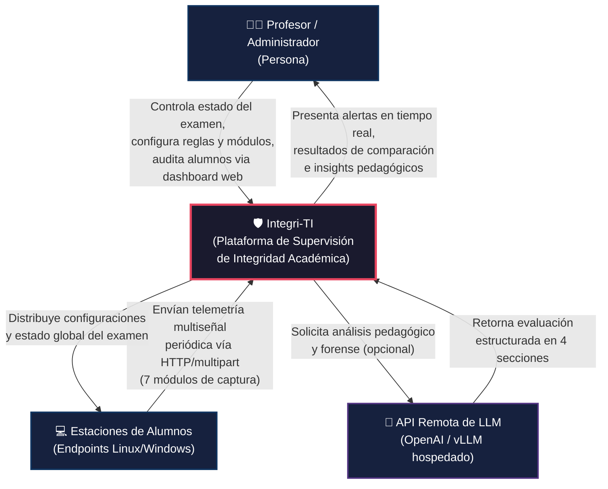
```mermaid
graph TD
    Profesor["👨‍🏫 Profesor / Administrador<br/>(Persona)"]
    IntegriTI["🛡️ Integri-TI<br/>(Plataforma de Supervisión<br/>de Integridad Académica)"]
    Alumnos["💻 Estaciones de Alumnos<br/>(Endpoints Linux/Windows)"]
    LLM["🤖 API Remota de LLM<br/>(OpenAI / vLLM hospedado)"]

    Profesor -->|"Controla estado del examen,<br/>configura reglas y módulos,<br/>audita alumnos via dashboard web"| IntegriTI
    IntegriTI -->|"Presenta alertas en tiempo real,<br/>resultados de comparación<br/>e insights pedagógicos"| Profesor
    Alumnos -->|"Envían telemetría multiseñal<br/>periódica vía HTTP/multipart<br/>(7 módulos de captura)"| IntegriTI
    IntegriTI -->|"Distribuye configuraciones<br/>y estado global del examen"| Alumnos
    IntegriTI -->|"Solicita análisis pedagógico<br/>y forense (opcional)"| LLM
    LLM -->|"Retorna evaluación<br/>estructurada en 4 secciones"| IntegriTI

    style IntegriTI fill:#1a1a2e,stroke:#e94560,stroke-width:3px,color:#fff
    style Profesor fill:#16213e,stroke:#0f3460,stroke-width:2px,color:#fff
    style Alumnos fill:#16213e,stroke:#0f3460,stroke-width:2px,color:#fff
    style LLM fill:#16213e,stroke:#533483,stroke-width:2px,color:#fff
```

### 3.2 Diagrama de Contenedores

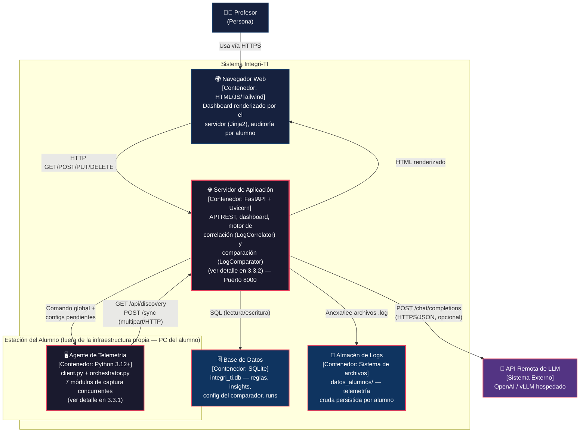
```mermaid
graph TB
    Profesor["👨‍🏫 Profesor<br/>(Persona)"]

    subgraph SYS["Sistema Integri-TI"]
        Browser["🌍 Navegador Web<br/>[Contenedor: HTML/JS/Tailwind]<br/>Dashboard renderizado por el<br/>servidor (Jinja2), auditoría por alumno"]

        subgraph DEPLOY["Estación del Alumno (fuera de la infraestructura propia — PC del alumno)"]
            TelemetryClient["🖥️ Agente de Telemetría<br/>[Contenedor: Python 3.12+]<br/>client.py + orchestrator.py<br/>7 módulos de captura concurrentes<br/>(ver detalle en 3.3.1)"]
        end

        APIServer["🌐 Servidor de Aplicación<br/>[Contenedor: FastAPI + Uvicorn]<br/>API REST, dashboard, motor de<br/>correlación (LogCorrelator) y<br/>comparación (LogComparator)<br/>(ver detalle en 3.3.2) — Puerto 8000"]

        Database["🗄️ Base de Datos<br/>[Contenedor: SQLite]<br/>integri_ti.db — reglas, insights,<br/>config del comparador, runs"]

        LogStore["📁 Almacén de Logs<br/>[Contenedor: Sistema de archivos]<br/>datos_alumnos/ — telemetría<br/>cruda persistida por alumno"]
    end

    LLM["🤖 API Remota de LLM<br/>[Sistema Externo]<br/>OpenAI / vLLM hospedado"]

    Profesor -->|"Usa vía HTTPS"| Browser
    Browser -->|"HTTP GET/POST/PUT/DELETE"| APIServer
    APIServer -->|"HTML renderizado"| Browser

    TelemetryClient -->|"GET /api/discovery<br/>POST /sync (multipart/HTTP)"| APIServer
    APIServer -->|"Comando global +<br/>configs pendientes"| TelemetryClient

    APIServer -->|"SQL (lectura/escritura)"| Database
    APIServer -->|"Anexa/lee archivos .log"| LogStore
    APIServer -->|"POST /chat/completions<br/>(HTTPS/JSON, opcional)"| LLM

    style Profesor fill:#16213e,stroke:#0f3460,stroke-width:2px,color:#fff
    style Browser fill:#16213e,stroke:#0f3460,stroke-width:2px,color:#fff
    style TelemetryClient fill:#1a1a2e,stroke:#e94560,stroke-width:2px,color:#fff
    style APIServer fill:#1a1a2e,stroke:#e94560,stroke-width:3px,color:#fff
    style Database fill:#0f3460,stroke:#e94560,stroke-width:2px,color:#fff
    style LogStore fill:#0f3460,stroke:#e94560,stroke-width:2px,color:#fff
    style LLM fill:#533483,stroke:#e94560,stroke-width:2px,color:#fff
```

> **Nota de despliegue:** el contenedor "Agente de Telemetría" es desarrollado y versionado por el equipo de Integri-TI (por eso es parte del sistema, no un sistema externo), pero se **despliega en hardware que no pertenece a la infraestructura del servidor** — el PC de cada alumno. El subgraph de arriba marca ese límite de despliegue sin sacar el contenedor del límite del sistema.

### 3.3 Diagrama de Componentes

#### 3.3.1 Componentes del Agente de Telemetría (Cliente)


```mermaid
graph TB
    subgraph "TelemetryClient (client.py)"
        TC_Discovery["DiscoveryEngine<br/>Escaneo LAN concurrente<br/>GET /api/discovery"]
        TC_State["StateMachine<br/>Control de estado local:<br/>ESPERANDO | GRABANDO | FINALIZADO"]
        TC_Sync["SyncManager<br/>Loop periódico de sincronización,<br/>subida multipart y control de errores"]
        TC_Config["RemoteConfigDispatcher<br/>Procesa configs_pendientes del servidor<br/>y las delega al orquestador"]
        TC_AlertBuffer["AlertBuffer<br/>Cola en memoria de alertas<br/>biométricas y del sistema"]
    end

    subgraph "Orchestrator (orchestrator.py)"
        OC_Supervisor["ProcessSupervisor<br/>Gestión de ciclo de vida de hilos:<br/>start_all, stop_all, restart_module, reset"]
        OC_Privilege["PrivilegeGuard<br/>Validación y elevación UAC<br/>(ShellExecuteW runas / sudo)"]
        OC_Config["ConfigHandler<br/>Lectura y escritura en caliente<br/>de config.txt por módulo"]
        OC_Merger["LogMerger<br/>combine_logs(): parseo de timestamps,<br/>normalización ISO y merge ordenado"]
    end

    subgraph "Módulos de Telemetría (Client/modules/)"
        subgraph "1. Program Monitor"
            PM_Core["ProgramMonitor (program_monitor.py)<br/>Loop de muestreo (poll_seconds)"]
            PM_Win["WindowTracker<br/>win32gui (Win) / xdotool (Linux)<br/>Ventana en primer plano"]
            PM_Proc["ProcessInspector<br/>psutil: PID y nombre de ejecutable"]
            PM_Cfg["program_monitor/config.txt"]
            PM_Log["program_monitor.log"]
        end

        subgraph "2. Keylogger"
            KL_Core["Keylogger (keylogger.py)<br/>Listener asíncrono"]
            KL_Hook["KeyboardHook<br/>pynput.keyboard.Listener"]
            KL_Short["ShortcutDetector<br/>Atajos (Ctrl+C, Ctrl+V, etc.) y foco"]
            KL_Cfg["keylogger/config.txt"]
            KL_Log["keylogger.log"]
        end

        subgraph "3. Network Sniffer"
            SN_Core["Sniffer (sniffer.py)<br/>Hilo de captura continua"]
            SN_Scapy["RawSniffer<br/>scapy.sniff sobre Npcap / libpcap"]
            SN_Parser["ProtocolParser<br/>DNS (puerto 53), HTTP y destinos IP"]
            SN_Cfg["sniffer/config.txt"]
            SN_Log["sniffer.log"]
        end

        subgraph "4. Paperclip (Portapapeles)"
            PP_Core["Paperclip (paperclip.py)<br/>Loop de sondeo de portapapeles"]
            PP_Hook["ClipboardWatcher<br/>pyperclip.paste()"]
            PP_Hash["ContentHasher<br/>Detección de cambios y hashes de texto"]
            PP_Cfg["paperclip/config.txt"]
            PP_Log["paperclip.log"]
        end

        subgraph "5. Error Detection & Python Auditor"
            ED_Core["ErrorDetection (error_detection.py)<br/>Supervisor de instalación y logs"]
            ED_Hook["RuntimeHook (mod_site_customize.py)<br/>Inyección en PYTHONPATH / sitecustomize"]
            ED_Audit["Auditor de Ejecuciones<br/>sys.excepthook, sys.stdin, sys.stdout"]
            ED_Cfg["error_detection/config.txt"]
            ED_Log["auditoria_python.log"]
        end

        subgraph "6. Keystroke Dynamics SVM"
            SVM_Core["KeystrokeSVM (svm_keystroke.py)<br/>Captura de dinámicas y scoring"]
            SVM_Feat["FeatureExtractor<br/>Dwell time (presión) y Flight time (vuelo)"]
            SVM_Model["OneClassSVM Classifier<br/>scikit-learn: Detección de anomalías"]
            SVM_Cfg["svm_keystroke_dym/config.txt"]
            SVM_Log["alerts.log"]
        end

        subgraph "7. USB Detection"
            USB_Core["USBDetection (usb_detection.py)<br/>Supervisor multiplataforma"]
            USB_OS["OSAdapter<br/>windows.py (WMI Win32_DiskDrive)<br/>linux.py (pyudev / sysfs)"]
            USB_Scan["VolumeAuditor & Hasher<br/>utils.py: Escaneo y SHA-256 de archivos"]
            USB_Cfg["usb_detection/config.txt"]
            USB_Log["usb_detection.log<br/>usb_export.log"]
        end
    end

    CombinedFile["📦 combined_log.log<br/>Log consolidado cronológico"]
    ServerAPI["🌐 Servidor Central FastAPI<br/>Endpoints /sync y /api/discovery"]

    %% Flujos TelemetryClient <-> Orchestrator
    TC_State -->|"Comandos start / stop / reset"| OC_Supervisor
    TC_Config -->|"change_config(modulo, clave, valor)"| OC_Config
    TC_Sync -->|"Solicita combine_logs()"| OC_Merger

    %% Orchestrator -> Módulos
    OC_Supervisor -->|"Inicia / detiene hilos daemon"| PM_Core
    OC_Supervisor -->|"Inicia / detiene hilos daemon"| KL_Core
    OC_Supervisor -->|"Inicia / detiene hilos daemon"| SN_Core
    OC_Supervisor -->|"Inicia / detiene hilos daemon"| PP_Core
    OC_Supervisor -->|"Inicia / instala / detiene"| ED_Core
    OC_Supervisor -->|"Inicia / detiene hilos daemon"| SVM_Core
    OC_Supervisor -->|"Inicia / detiene hilos daemon"| USB_Core

    OC_Config -->|"Lee y actualiza parámetros en"| PM_Cfg
    OC_Config -->|"Lee y actualiza parámetros en"| KL_Cfg
    OC_Config -->|"Lee y actualiza parámetros en"| SN_Cfg
    OC_Config -->|"Lee y actualiza parámetros en"| PP_Cfg
    OC_Config -->|"Lee y actualiza parámetros en"| ED_Cfg
    OC_Config -->|"Lee y actualiza parámetros en"| SVM_Cfg
    OC_Config -->|"Lee y actualiza parámetros en"| USB_Cfg

    %% Internos de cada módulo
    PM_Core --> PM_Win
    PM_Core --> PM_Proc
    PM_Core -->|"Escribe"| PM_Log
    PM_Cfg -.-> PM_Core

    KL_Core --> KL_Hook
    KL_Core --> KL_Short
    KL_Core -->|"Escribe"| KL_Log
    KL_Cfg -.-> KL_Core

    SN_Core --> SN_Scapy
    SN_Core --> SN_Parser
    SN_Core -->|"Escribe"| SN_Log
    SN_Cfg -.-> SN_Core

    PP_Core --> PP_Hook
    PP_Core --> PP_Hash
    PP_Core -->|"Escribe"| PP_Log
    PP_Cfg -.-> PP_Core

    ED_Core --> ED_Hook
    ED_Hook --> ED_Audit
    ED_Audit -->|"Escribe"| ED_Log
    ED_Cfg -.-> ED_Core

    SVM_Core --> SVM_Feat
    SVM_Core --> SVM_Model
    SVM_Core -->|"Escribe alertas"| SVM_Log
    SVM_Core -->|"Encola alerta en"| TC_AlertBuffer
    SVM_Cfg -.-> SVM_Core

    USB_Core --> USB_OS
    USB_Core --> USB_Scan
    USB_Core -->|"Escribe eventos y hashes"| USB_Log
    USB_Cfg -.-> USB_Core

    %% Salidas hacia LogMerger y Servidor
    PM_Log --> OC_Merger
    KL_Log --> OC_Merger
    SN_Log --> OC_Merger
    PP_Log --> OC_Merger
    ED_Log --> OC_Merger
    SVM_Log --> OC_Merger
    USB_Log --> OC_Merger

    OC_Merger -->|"Escribe"| CombinedFile
    CombinedFile -->|"Leído por"| TC_Sync
    TC_AlertBuffer -->|"Leído por"| TC_Sync

    TC_Discovery -->|"GET /api/discovery"| ServerAPI
    TC_Sync -->|"POST /sync (multipart upload)"| ServerAPI
    ServerAPI -->|"Responde comando y configs_pendientes"| TC_Sync
    TC_Sync --> TC_State
    TC_Sync --> TC_Config

    style TC_Sync fill:#1a1a2e,stroke:#e94560,stroke-width:2px,color:#fff
    style TC_State fill:#1a1a2e,stroke:#e94560,stroke-width:2px,color:#fff
    style TC_Discovery fill:#1a1a2e,stroke:#0f3460,stroke-width:2px,color:#fff
    style TC_Config fill:#1a1a2e,stroke:#0f3460,stroke-width:2px,color:#fff
    style TC_AlertBuffer fill:#1a1a2e,stroke:#533483,stroke-width:2px,color:#fff
    style OC_Supervisor fill:#0f3460,stroke:#e94560,stroke-width:2px,color:#fff
    style OC_Privilege fill:#0f3460,stroke:#0f3460,stroke-width:2px,color:#fff
    style OC_Config fill:#0f3460,stroke:#0f3460,stroke-width:2px,color:#fff
    style OC_Merger fill:#0f3460,stroke:#e94560,stroke-width:2px,color:#fff
    style CombinedFile fill:#0f3460,stroke:#e94560,stroke-width:2px,color:#fff
    style ServerAPI fill:#533483,stroke:#e94560,stroke-width:2px,color:#fff
```

##### Resumen de Módulos del Cliente de Telemetría

| # | Módulo | Script Principal | Librerías / Drivers | Archivo de Configuración | Archivo de Log Generado | Descripción y Telemetría Capturada |
|---|---|---|---|---|---|---|
| **1** | **Program Monitor** | `program_monitor.py` | `psutil`, `win32gui` (Win) / `xdotool` (Linux) | `program_monitor/config.txt` | `program_monitor.log` | Muestrea a intervalos configurables la ventana activa en primer plano, título de ventana, nombre del ejecutable y PID. |
| **2** | **Keylogger** | `keylogger.py` | `pynput.keyboard` | `keylogger/config.txt` | `keylogger.log` | Captura pulsaciones de teclas y atajos contextuales (Ctrl+C, Ctrl+V, etc.) registrando la ventana donde ocurrieron. |
| **3** | **Network Sniffer** | `sniffer.py` | `scapy`, `Npcap 1.79` (Win) / `libpcap` (Linux) | `sniffer/config.txt` | `sniffer.log` | Sniffer en modo promiscuo que intercepta consultas DNS (puerto 53), peticiones HTTP y destinos IP externos. |
| **4** | **Paperclip** | `paperclip.py` | `pyperclip` | `paperclip/config.txt` | `paperclip.log` | Monitorea el portapapeles del sistema detectando nuevo contenido copiado/pegado, longitud y hash para correlación. |
| **5** | **Error Detection** | `error_detection.py` + `mod_site_customize.py` | `sys.excepthook`, `sitecustomize` | `error_detection/config.txt` | `auditoria_python.log` | Hook inyectado en `PYTHONPATH` (`.telemetria_global`) que audita ejecuciones de Python, tracebacks, prints y entradas `stdin`. |
| **6** | **Keystroke Dynamics SVM** | `svm_keystroke.py` | `pynput`, `scikit-learn` (`OneClassSVM`), `numpy` | `svm_keystroke_dym/config.txt` | `alerts.log` | Extrae tiempos de vuelo (*flight time*) y permanencia (*dwell time*); entrena un modelo One-Class SVM para detectar suplantación o tipeo anómalo. |
| **7** | **USB Detection** | `usb_detection.py`, `windows.py`, `linux.py`, `utils.py` | `wmi` (Win), `pyudev` (Linux), `hashlib` | `usb_detection/config.txt` | `usb_detection.log`, `usb_export.log` | Detecta conexión y desconexión de dispositivos de almacenamiento USB, indexa archivos contenidos y calcula hashes SHA-256. |

#### 3.3.2 Componentes del Servidor

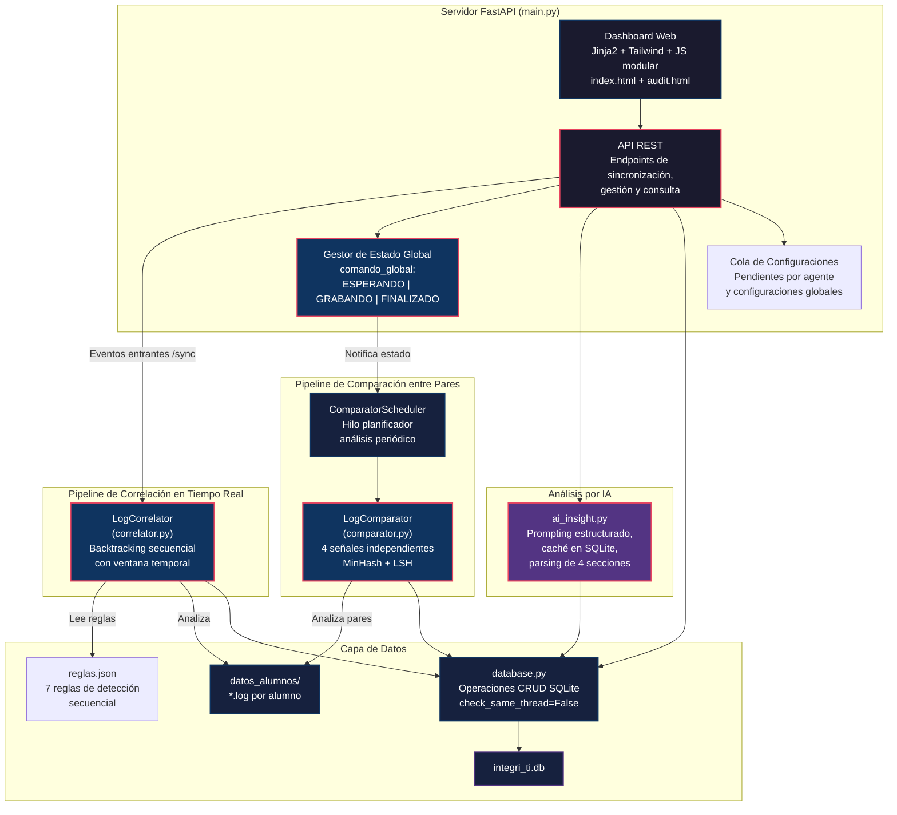
```mermaid
graph TB
    subgraph "Servidor FastAPI (main.py)"
        Routes["API REST<br/>Endpoints de sincronización,<br/>gestión y consulta"]
        Dashboard["Dashboard Web<br/>Jinja2 + Tailwind + JS modular<br/>index.html + audit.html"]
        StateManager["Gestor de Estado Global<br/>comando_global:<br/>ESPERANDO | GRABANDO | FINALIZADO"]
        ConfigQueue["Cola de Configuraciones<br/>Pendientes por agente<br/>y configuraciones globales"]
    end

    subgraph "Pipeline de Correlación en Tiempo Real"
        Correlator["LogCorrelator<br/>(correlator.py)<br/>Backtracking secuencial<br/>con ventana temporal"]
    end

    subgraph "Pipeline de Comparación entre Pares"
        Comparator["LogComparator<br/>(comparator.py)<br/>4 señales independientes<br/>MinHash + LSH"]
        Scheduler["ComparatorScheduler<br/>Hilo planificador<br/>análisis periódico"]
    end

    subgraph "Análisis por IA"
        AIInsight["ai_insight.py<br/>Prompting estructurado,<br/>caché en SQLite,<br/>parsing de 4 secciones"]
    end

    subgraph "Capa de Datos"
        DBModule["database.py<br/>Operaciones CRUD SQLite<br/>check_same_thread=False"]
        ReglaFile["reglas.json<br/>7 reglas de detección<br/>secuencial"]
        SQLite["integri_ti.db"]
        LogDir["datos_alumnos/<br/>*.log por alumno"]
    end

    Routes -->|"Eventos entrantes /sync"| Correlator
    Correlator -->|"Lee reglas"| ReglaFile
    Correlator -->|"Analiza"| LogDir
    Routes --> StateManager
    StateManager -->|"Notifica estado"| Scheduler
    Scheduler --> Comparator
    Comparator -->|"Analiza pares"| LogDir
    Routes --> AIInsight
    Routes --> DBModule
    Correlator --> DBModule
    Comparator --> DBModule
    AIInsight --> DBModule
    DBModule --> SQLite
    Dashboard --> Routes
    Routes --> ConfigQueue

    style Routes fill:#1a1a2e,stroke:#e94560,stroke-width:2px,color:#fff
    style Dashboard fill:#1a1a2e,stroke:#0f3460,stroke-width:2px,color:#fff
    style StateManager fill:#0f3460,stroke:#e94560,stroke-width:2px,color:#fff
    style Correlator fill:#0f3460,stroke:#e94560,stroke-width:2px,color:#fff
    style Comparator fill:#0f3460,stroke:#e94560,stroke-width:2px,color:#fff
    style Scheduler fill:#16213e,stroke:#0f3460,stroke-width:2px,color:#fff
    style AIInsight fill:#533483,stroke:#e94560,stroke-width:2px,color:#fff
    style DBModule fill:#16213e,stroke:#0f3460,stroke-width:2px,color:#fff
    style SQLite fill:#16213e,stroke:#533483,stroke-width:2px,color:#fff
    style LogDir fill:#16213e,stroke:#0f3460,stroke-width:2px,color:#fff
```

### 3.4 Diagrama de Código (Módulos Críticos)

#### 3.4.1 Estructura de Clases del Cliente

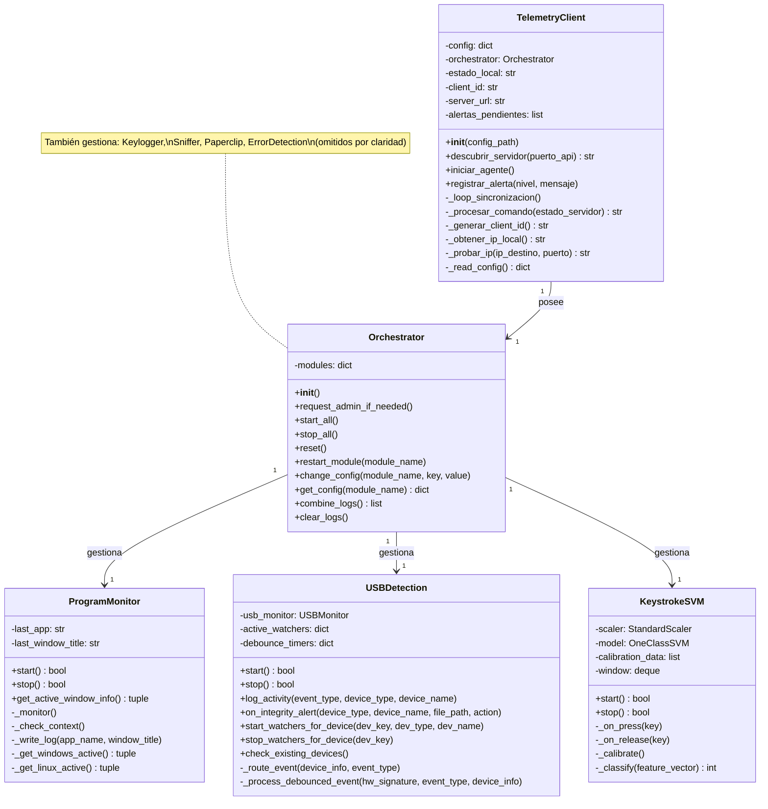
```mermaid
classDiagram
    class TelemetryClient {
        -config: dict
        -orchestrator: Orchestrator
        -estado_local: str
        -client_id: str
        -server_url: str
        -alertas_pendientes: list
        +__init__(config_path)
        +descubrir_servidor(puerto_api) str
        +iniciar_agente()
        +registrar_alerta(nivel, mensaje)
        -_loop_sincronizacion()
        -_procesar_comando(estado_servidor) str
        -_generar_client_id() str
        -_obtener_ip_local() str
        -_probar_ip(ip_destino, puerto) str
        -_read_config() dict
    }

    class Orchestrator {
        -modules: dict
        +__init__()
        +request_admin_if_needed()
        +start_all()
        +stop_all()
        +reset()
        +restart_module(module_name)
        +change_config(module_name, key, value)
        +get_config(module_name) dict
        +combine_logs() list
        +clear_logs()
    }

    class ProgramMonitor {
        -last_app: str
        -last_window_title: str
        +start() bool
        +stop() bool
        +get_active_window_info() tuple
        -_monitor()
        -_check_context()
        -_write_log(app_name, window_title)
        -_get_windows_active() tuple
        -_get_linux_active() tuple
    }

    class USBDetection {
        -usb_monitor: USBMonitor
        -active_watchers: dict
        -debounce_timers: dict
        +start() bool
        +stop() bool
        +log_activity(event_type, device_type, device_name)
        +on_integrity_alert(device_type, device_name, file_path, action)
        +start_watchers_for_device(dev_key, dev_type, dev_name)
        +stop_watchers_for_device(dev_key)
        +check_existing_devices()
        -_route_event(device_info, event_type)
        -_process_debounced_event(hw_signature, event_type, device_info)
    }

    class KeystrokeSVM {
        -scaler: StandardScaler
        -model: OneClassSVM
        -calibration_data: list
        -window: deque
        +start() bool
        +stop() bool
        -_on_press(key)
        -_on_release(key)
        -_calibrate()
        -_classify(feature_vector) int
    }

    TelemetryClient "1" --> "1" Orchestrator : posee
    Orchestrator "1" --> "1" ProgramMonitor : gestiona
    Orchestrator "1" --> "1" USBDetection : gestiona
    Orchestrator "1" --> "1" KeystrokeSVM : gestiona

    note for Orchestrator "También gestiona: Keylogger,\nSniffer, Paperclip, ErrorDetection\n(omitidos por claridad)"
```

#### 3.4.2 Patrón de Descubrimiento Automático de Servidor

El agente implementa un **mecanismo de descubrimiento automático** que no requiere configuración previa de la dirección IP del servidor:

1. Si `server_ip` está definido en `config.txt`, intenta conexión directa.
2. Si no, escanea la subred local `/24` y rangos estándar de redes privadas (`192.168.0.x`, `192.168.1.x`, `192.168.100.x`) usando `ThreadPoolExecutor(max_workers=100)`.
3. Cada IP candidata es probada contra `GET /api/discovery` con timeout de 0.5s.
4. El servidor solo acepta conexiones si `comando_global == "ESPERANDO"` (HTTP 200); si está en otro estado retorna HTTP 403.

#### 3.4.3 Patrón de Comunicación Desacoplada por Logs

Los 7 módulos de telemetría **no se comunican directamente entre sí**. Cada uno escribe en su propio archivo de log con formato `[{timestamp}][{módulo}] {contenido}`. El `Orchestrator` compila y ordena cronológicamente todos los logs en `combined_log.log`, que se envía al servidor como archivo adjunto en el siguiente ciclo de sincronización. Tras el envío exitoso, todos los archivos de log se truncan a 0 bytes.

---

## 4. Registros de Decisiones Arquitectónicas (ADRs)

### 4.1 Justificación de Tecnologías Seleccionadas

#### ADR-001: Python como lenguaje principal

| Campo | Detalle |
|---|---|
| **Estado** | Aceptada |
| **Contexto** | El proyecto abarca tres frentes de naturaleza distinta: instrumentación de bajo nivel del sistema operativo, un servidor web, y modelos de aprendizaje automático. Se requiere un lenguaje capaz de cubrir los tres sin fragmentar el desarrollo en múltiples stacks. Adicionalmente, el dominio de aplicación son evaluaciones de programación que, en el contexto académico del autor, se imparten en Python — lo que impone como restricción funcional desde el diseño inicial la capacidad de auditar la ejecución de código Python del alumno, no como una extensión posterior. |
| **Decisión** | Utilizar Python ≥ 3.10 tanto para el agente como para el servidor. |
| **Justificación** | (1) Un único lenguaje cubre los tres frentes del proyecto, evitando la sobrecarga de coordinar herramientas y entornos distintos; (2) soporte multiplataforma nativo, que reduce la necesidad de lógica específica por sistema operativo a los puntos estrictamente requeridos (WMI/udev, ShellExecuteW/sudo); (3) frente a un lenguaje de bajo nivel como C, evita la gestión manual de memoria y de APIs específicas por SO, complejidad no justificada por los objetivos del proyecto; (4) disponibilidad de librerías maduras para cada frente: `psutil`, `pynput`, `scapy`, `wmi` y `ctypes` para instrumentación del sistema operativo; `scikit-learn` y `numpy` para los componentes de aprendizaje automático; `FastAPI` para el servidor; `datasketch` para similitud de conjuntos en tiempo sub-cuadrático; (5) como el dominio evaluado es Python, usar el mismo lenguaje en el agente permite instrumentar directamente el intérprete objetivo (vía `sitecustomize` y `sys.excepthook`, ver módulo de detección de errores) sin necesidad de un lenguaje puente adicional para auditar las ejecuciones del alumno. |
| **Consecuencias** | El agente consume más recursos que una implementación equivalente en C o Rust. Este costo se considera aceptable dado que la prioridad del proyecto es la cobertura de los tres frentes mencionados con un único lenguaje, no la eficiencia de bajo nivel. En Windows se utiliza específicamente Python 3.14 por mejoras de rendimiento en el lanzador `py`. Al estar el módulo de detección de errores acoplado específicamente al runtime de Python, evaluaciones en otros lenguajes quedarían fuera del alcance de esa auditoría específica sin desarrollo adicional. |

#### ADR-002: FastAPI como framework web del servidor

| Campo | Detalle |
|---|---|
| **Estado** | Aceptada |
| **Contexto** | El servidor debe manejar concurrentemente la recepción de telemetría de múltiples agentes, análisis en tiempo real, una API REST para el dashboard, y llamadas asíncronas a servicios de IA. |
| **Decisión** | Utilizar FastAPI con Uvicorn como servidor ASGI. |
| **Justificación** | (1) Se descartó Django por incluir componentes no requeridos por el alcance actual del proyecto (ORM completo, panel de administración, sistema de autenticación integrado), cuya configuración y mantenimiento representarían sobrecarga sin beneficio directo; (2) se descartó Flask por su modelo de ejecución sincrónico, menos adecuado para el manejo concurrente de I/O que exigen las llamadas a servicios de IA; (3) soporte nativo de `async`/`await`, necesario para no bloquear el event loop durante llamadas HTTP externas; (4) manejo eficiente de `multipart/form-data` para la recepción de archivos de log; (5) generación automática de documentación OpenAPI; (6) integración directa con `httpx` (cliente asíncrono) y `Jinja2` (motor de plantillas). |
| **Alternativas descartadas** | Flask (modelo sincrónico, peor manejo de I/O concurrente); Django (funcionalidades adicionales no requeridas por el alcance del proyecto). |

#### ADR-003: SQLite como base de datos

| Campo | Detalle |
|---|---|
| **Estado** | Aceptada |
| **Contexto** | Se requiere persistencia para reglas de detección, insights generados por IA, configuración del comparador e historial de ejecuciones, sin incorporar infraestructura adicional de servidor. |
| **Decisión** | Utilizar SQLite con `check_same_thread=False` y `row_factory=sqlite3.Row`. |
| **Justificación** | (1) El volumen y la escala de datos del proyecto no justifican la operación de un servidor de base de datos independiente como PostgreSQL; (2) no requiere instalación ni configuración de un motor de base de datos externo, y se ejecuta de forma nativa en cualquier sistema operativo soportado; (3) el despliegue se reduce a un único archivo (`integri_ti.db`); (4) la telemetría cruda se persiste por separado, en archivos `.log`, lo que reduce adicionalmente la carga sobre la base de datos. |
| **Consecuencias** | La telemetría bruta se almacena en el sistema de archivos (`datos_alumnos/*.log`) y no en SQLite. Esta separación es deliberada: optimiza el rendimiento de escritura y facilita el análisis de archivos completos por parte del comparador. |

#### ADR-004: Integración con una API remota de modelos de lenguaje compatible con la especificación de OpenAI

| Campo | Detalle |
|---|---|
| **Estado** | Aceptada |
| **Contexto** | Uno de los objetivos del proyecto de título es evaluar la aplicación de modelos de lenguaje al análisis de grandes volúmenes de telemetría textual, de difícil revisión manual. El sistema debe además poder ejecutarse en hardware de alcance limitado — un equipo de sala de clases o el escritorio del docente —, sin requerir infraestructura de cómputo especializada. |
| **Decisión** | Integrar el análisis de IA mediante la especificación de Chat Completions (compatible con OpenAI), consumida como servicio remoto configurable por variables de entorno. |
| **Justificación** | (1) Ejecutar localmente un modelo de lenguaje de tamaño suficiente para este análisis es computacionalmente costoso; delegar la inferencia a un servicio remoto mantiene los requisitos de hardware local acotados a los de un equipo de escritorio convencional; (2) se prioriza el uso de modelos con ventana de contexto amplia — específicamente GPT-Luna, GPT-Terra y GPT-Sol, que ofrecen hasta aproximadamente 1 millón de tokens de contexto vía API —, dado que el análisis requiere procesar el conjunto completo de logs de un examen en una sola pasada, no fragmentos; (3) al integrarse mediante la especificación estándar de Chat Completions —y no contra la API propietaria de un proveedor específico— el mismo código permite conectar a distintos proveedores compatibles cambiando únicamente `OPENAI_BASE_URL` y `OPENAI_MODEL`, sin modificar la implementación; (4) autenticación estándar vía token Bearer; (5) uso de `httpx.AsyncClient` con timeout de 90 segundos, evitando bloquear el servidor durante la inferencia; (6) los resultados se cachean en SQLite para evitar llamadas redundantes y su costo asociado. |
| **Consecuencias** | Requiere conexión a un servicio de LLM accesible por red. El componente es opcional: si `OPENAI_API_KEY` no está configurado, el sistema opera sin generación de insights de IA. |

#### ADR-005: Comunicación cliente-servidor por HTTP polling con sincronización multipart

| Campo | Detalle |
|---|---|
| **Estado** | Aceptada |
| **Contexto** | El servidor debe recibir telemetría (texto y archivos) de múltiples agentes de forma concurrente, y a la vez transmitirles comandos de estado y configuraciones pendientes. |
| **Decisión** | Utilizar HTTP polling sobre un endpoint `/sync` que acepta `multipart/form-data`, con intervalo configurable de 15 segundos por defecto. |
| **Justificación** | (1) Un modelo de conexiones persistentes (WebSockets) obliga al servidor a mantener y gestionar el estado de cada conexión abierta —reconexión, *keep-alive*, detección de caídas— para un número potencialmente alto de agentes simultáneos; el modelo HTTP *stateless* con polling evita esa gestión de estado por diseño, a cambio de una latencia acotada por el intervalo de sondeo, considerada aceptable para este caso de uso; (2) un único endpoint bidireccional (`/sync`) resuelve en una sola petición tanto el envío de telemetría como la recepción del estado global y las configuraciones pendientes; (3) mayor compatibilidad con firewalls y redes educativas que restringen o bloquean WebSockets; (4) `multipart/form-data` permite adjuntar el log combinado junto con sus metadatos en una única petición; (5) tolerancia a pérdida de conexión mediante reconexión automática (3 reintentos antes de reset y redescubrimiento). |
| **Alternativas descartadas** | WebSockets (gestión de estado por conexión persistente, incompatibilidad con proxies educativos); MQTT (requiere un broker adicional); gRPC (overhead de configuración no justificado para este caso de uso). |

#### ADR-006: Tailwind CSS vía CDN para el dashboard

| Campo | Detalle |
|---|---|
| **Estado** | Aceptada |
| **Contexto** | El dashboard requiere una interfaz visual coherente y profesional, sin incorporar un pipeline de build de frontend. |
| **Decisión** | Utilizar HTML y JavaScript sin framework, con Tailwind CSS vía CDN y configuración personalizada inline. |
| **Justificación** | (1) El alcance funcional del dashboard no justifica la complejidad de un proyecto basado en un framework como React; (2) Tailwind vía CDN permite mantener una estética cuidada sin incurrir en un proceso de compilación previo; (3) no requiere Node.js, webpack ni npm, simplificando el despliegue; (4) el enfoque *utility-first* permite iterar la interfaz con rapidez; (5) se complementa con una hoja de estilos mínima (`styles.css`) para tipografías (Inter, JetBrains Mono), barras de desplazamiento y animaciones de pulso, y con configuración de colores de marca y *breakpoints* personalizados (`xs: 480px`, `3xl: 1920px`). |

### 4.2 Justificación de Algoritmos de Análisis Conductual

#### ADR-007: Correlación secuencial con backtracking temporal

| Campo | Detalle |
|---|---|
| **Estado** | Aceptada |
| **Contexto** | Las infracciones observables rara vez corresponden a un evento aislado, sino a una secuencia de acciones: una acción individual (por ejemplo, copiar contenido al portapapeles) no constituye evidencia por sí sola; su relevancia depende de las acciones que la preceden o suceden dentro de una ventana de tiempo acotada. Adicionalmente, cada contexto de evaluación exige criterios de detección distintos, y no es razonable requerir que el docente los defina mediante programación. |
| **Decisión** | Implementar un motor de correlación por backtracking que evalúa cadenas de eventos secuenciales multi-módulo contra reglas configurables, definidas mediante patrones de expresión regular y ventanas temporales. |
| **Justificación** | (1) El modelo de reglas admite secuencias de $k$ pasos $[P_0, P_1, \dots, P_k]$, capturando que la infracción es un proceso, no una acción puntual; (2) la ventana temporal es la que otorga significado a la secuencia: dos eventos aislados sin restricción temporal no constituyen evidencia; (3) las reglas se definen de forma declarativa y configurable, sin requerir que el docente programe, dado que cada entorno de evaluación exige criterios propios; (4) la persistencia de la telemetría en texto plano permite su procesamiento mediante expresiones regulares con bajo costo computacional; (5) la búsqueda recursiva con poda por ventana temporal ($\Delta t \leq W$) evita la explosión combinatoria; (6) el mapeo exacto de líneas de log permite auditoría forense precisa; (7) se aplica un *debounce* de 15 segundos para evitar alertas duplicadas. |
| **Algoritmo** | Para una regla con pasos $[P_0, \dots, P_k]$ y ventana $W$: se localiza un evento $E_0$ que satisface $P_0$; para cada paso siguiente $P_j$, se exploran eventos posteriores $E_i$ tales que $E_i.ts \geq E_{j-1}.ts$ y $E_i.ts - E_0.ts \leq W$. Si se completa la cadena, se registra la infracción con $\Delta t = E_k.ts - E_0.ts$ y las líneas de log correspondientes. |

#### ADR-008: Comparación multiseñal con MinHash/LSH

| Campo | Detalle |
|---|---|
| **Estado** | Aceptada |
| **Contexto** | Se requiere comparar los logs de $N$ alumnos entre sí para detectar colusión, plagio de código y sincronización de comportamiento. Una comparación exhaustiva de todos los pares posibles ($O(N^2)$) resulta computacionalmente costosa a medida que $N$ crece. Adicionalmente, la colaboración entre alumnos puede manifestarse de formas distintas a la similitud textual directa. |
| **Decisión** | Implementar un comparador multiseñal de cuatro dimensiones, con filtrado previo mediante LSH (*Locality Sensitive Hashing*) para acotar el conjunto de pares candidatos antes del análisis exhaustivo. |
| **Justificación** | (1) LSH permite identificar los pares de logs con probabilidad relevante de similitud sin necesidad de compararlos exhaustivamente de antemano, reduciendo el espacio de búsqueda a un subconjunto de candidatos; (2) dado que dos personas no necesariamente escriben código de forma idéntica al colaborar, se incorporan señales adicionales a la similitud textual —coincidencia de acciones dentro de ventanas de tiempo comparables— como evidencia complementaria de coordinación. |
| **Algoritmo** | El comparador evalúa cuatro señales independientes: **(1) similitud de código**, mediante reconstrucción del texto tecleado (emulando cursor bidireccional), normalización, extracción de $k$-shingles ($k=5$ por defecto) y firmas `MinHash(num_perm=128)` indexadas en `MinHashLSH(threshold=0.35)`, con similitud de Jaccard exacta $J(A,B) = \|S_A \cap S_B\| / \|S_A \cup S_B\|$; **(2) portapapeles compartido**, mediante índice invertido y `difflib.SequenceMatcher`; **(3) sincronía de fugas de contexto**, detectando abandono simultáneo (diferencia $\leq 8$s por defecto) de la whitelist de aplicaciones permitidas, con verificación de tráfico de red concurrente; **(4) sincronía de ejecución**, detectando ejecuciones del mismo script con diferencia $\leq 8$s por defecto y salidas de consola idénticas. El score compuesto se calcula como $\text{Score} = w_1\,J_{\text{código}} + w_2\,\text{Sim}_{\text{clip}} + w_3\,\text{Sync}_{\text{fuga}} + w_4\,\text{Sync}_{\text{exec}}$, con reglas de escalación y clasificación en niveles CRÍTICO, ALTO y MEDIO según los umbrales definidos. Tanto los pesos $w_1$–$w_4$ como los umbrales de escalación y severidad son parámetros configurables (ver 5.2.5); los valores de referencia usados por defecto son $w_1=0.45$, $w_2=0.35$, $w_3=0.15$, $w_4=0.05$. |

#### ADR-009: Dinámica de tecleo mediante One-Class SVM

| Campo | Detalle |
|---|---|
| **Estado** | Aceptada (integrada como módulo del agente) |
| **Contexto** | Se requiere detectar cambios de operador durante una evaluación (por ejemplo, que un alumno ceda su equipo a otro para que resuelva el examen en su lugar). Un enfoque inicial basado en el promedio del ritmo de tecleo resultó insuficiente: la forma de escribir de una persona varía naturalmente según el estado cognitivo (por ejemplo, al pensar una respuesta), y un umbral fijo sobre ese promedio resulta o demasiado estricto o demasiado permisivo. |
| **Decisión** | Implementar un módulo de autenticación biométrica continua basado en la dinámica de tecleo, mediante un clasificador One-Class SVM con kernel RBF, que evalúa la pertenencia de una muestra a la distribución previamente aprendida, en lugar de compararla contra un valor fijo. |
| **Justificación** | (1) A diferencia de un umbral sobre un promedio fijo, el clasificador evalúa la similitud de cada muestra respecto a la distribución de referencia mediante su función de decisión, lo que permite capturar la variabilidad natural del usuario; (2) la elección del método se sustenta en literatura que compara técnicas de autenticación continua basada en dinámica de tecleo; (3) el método debía poder entrenarse con una muestra de calibración breve, tomada del propio alumno al inicio de la evaluación; las alternativas consideradas requerían un conjunto de entrenamiento previo, obtenido en sesiones separadas y con repetición del mismo texto, lo cual resultaba inviable en el contexto de uso. |
| **Vector biométrico** | Cada pulsación genera un vector $\mathbf{x} = [\text{flight\_time}, \text{hold\_time}]$, donde *flight time* es la latencia entre pulsaciones consecutivas ($<1.5$s) y *hold time* es el tiempo de retención de la tecla ($<0.5$s). |
| **Pipeline** | (1) Calibración con 100 vectores; (2) normalización mediante `StandardScaler`; (3) entrenamiento de `OneClassSVM(nu=0.05, kernel="rbf", gamma="scale")`; (4) clasificación en tiempo real mediante `predict()`, que retorna $+1$ (normal) o $-1$ (anomalía). |
| **Umbral de alerta** | Sobre una ventana móvil de 60 pulsaciones, se genera una alerta de posible cambio de operador si la proporción de anomalías alcanza o supera el 25% (15 de 60). |

> **Nota.** Se implementó adicionalmente una alternativa basada en Z-Score sobre el flight time, con calibración de 50 muestras y umbral $Z > 2.5$, evaluada sobre una ventana móvil de 40 teclas con alerta al 20% de anomalías, como punto de comparación frente al enfoque basado en SVM.

### 4.3 Justificación de Restricciones de Plataforma

#### ADR-010: Soporte de distribuciones Linux basado en X11; detección y conmutación automática desde Wayland

| Campo | Detalle |
|---|---|
| **Estado** | Aceptada |
| **Contexto** | El agente de telemetría en Linux requiere capturar la ventana activa, los procesos asociados y eventos de teclado a nivel global, funciones cuya disponibilidad depende directamente del servidor de visualización (X11 o Wayland) sobre el que corre la sesión. |
| **Decisión** | Se omite la posibilidad de soportar Wayland. Soportar cualquier distribución de Linux que utilice X11 como servidor de visualización, sin restricción por distribución específica — validado explícitamente en Linux Mint, Kali Linux y Debian. En el proceso de instalación se verifica si es posible cambiar a una sesión X11 para el correcto funcionamiento, y se realiza en caso de ser posible, sin que el usuario deba configurar nada adicionalmente — comportamiento verificado en Debian. |
| **Justificación** | (1) X11 expone una API estándar y uniforme para consultar la ventana activa, enumerar procesos asociados a ventanas e interceptar eventos de teclado de forma global, independiente del entorno de escritorio o distribución; (2) Wayland aísla deliberadamente cada aplicación cliente del compositor y de las demás aplicaciones por motivos de seguridad, restringiendo por diseño el mismo acceso global a teclado y ventanas que este proyecto requiere — el modelo de aislamiento que dificulta el keylogging malicioso también impide, sin mediación adicional, la telemetría legítima necesaria aquí; (3) dar soporte nativo a Wayland exigiría implementar `xdg-desktop-portal` u otro mecanismo específico por compositor (Mutter, KWin, wlroots, entre otros), cada uno con su propio modelo de permisos, multiplicando el esfuerzo de mantenimiento sin garantía de paridad funcional entre compositores; (4) en vez de asumir ese costo, el instalador resuelve el problema en el punto de entrada: detecta la sesión activa (vía `$XDG_SESSION_TYPE` u equivalente) y, si el gestor de sesión de la distribución lo permite, fuerza el arranque en X11 antes de desplegar el agente, evitando exponer al usuario la incompatibilidad de forma manual. |
| **Alternativas descartadas** | Soporte simultáneo de X11 y Wayland mediante una capa de abstracción de backend (descartado por el costo de mantener dos rutas de captura con garantías de acceso distintas); exigir al usuario cambiar manualmente de sesión antes de instalar (descartado en favor de resolverlo automáticamente desde el instalador, reduciendo fricción de despliegue). |
| **Consecuencias** | En distribuciones o configuraciones donde el gestor de sesión no permite forzar X11 (por ejemplo, un compositor Wayland sin sesión Xorg instalada o disponible como alternativa), la conmutación automática no es posible y la instalación no puede completarse hasta instalar dicha alternativa. Este comportamiento de detección y conmutación se ha verificado específicamente en Debian; su cobertura en otras distribuciones depende de que estas ofrezcan una sesión Xorg instalable junto a Wayland. |

---

## 5. Datos y Comunicación

### 5.1 Especificación de Endpoints del Servidor

#### Endpoints Principales del Agente

| Método | Ruta | Tipo | Descripción |
|---|---|---|---|
| `GET` | `/api/discovery` | Handshake | Compuerta de admisión. Retorna `200` si `comando_global == "ESPERANDO"`, `403` en cualquier otro estado. |
| `POST` | `/sync` | Sincronización | Endpoint principal de comunicación bidireccional agente ↔ servidor. |
| `GET` | `/profesor/comando/{nuevo_comando}` | Control | Cambia el estado global del examen (`ESPERANDO` / `GRABANDO` / `FINALIZADO`). |

#### Endpoints del Dashboard (API REST)

| Método | Ruta | Descripción |
|---|---|---|
| `GET` | `/` | Dashboard principal (`index.html`) |
| `GET` | `/auditoria/{client_id}` | Vista de auditoría forense por alumno (`audit.html`) |
| `GET` | `/api/status` | Estado operativo en tiempo real (clientes, alertas, logs recientes) |
| `POST` | `/api/alertas/limpiar` | Limpia historial de alertas en memoria |

#### Endpoints de Reglas

| Método | Ruta | Request Body | Descripción |
|---|---|---|---|
| `GET` | `/api/reglas` | — | Lista todas las reglas de correlación |
| `POST` | `/api/reglas` | `{nombre, severidad, ventana_segundos, pasos[]}` | Crea/actualiza regla y reanaliza logs existentes |
| `DELETE` | `/api/reglas/{regla_id}` | — | Elimina una regla |
| `POST` | `/api/reglas/reanalizar` | — | Limpia alertas y reejecuta correlación sobre todos los `.log` |

#### Endpoints de Módulos (Configuración Remota)

| Método | Ruta | Query/Body | Descripción |
|---|---|---|---|
| `GET` | `/api/modulos` | `?destino=global\|client_id` | Obtiene configuraciones de todos los módulos |
| `GET` | `/api/modulos/{nombre}` | `?destino=...` | Obtiene configuración de un módulo específico |
| `POST` | `/api/modulos/{nombre}` | `{destino, valores}` | Encola cambios de configuración para el próximo `/sync` |

#### Endpoints de Logs y Auditoría

| Método | Ruta | Descripción |
|---|---|---|
| `GET` | `/api/logs/{client_id}` | Descarga directa del archivo `.log` crudo (text/plain UTF-8) |
| `GET` | `/api/auditoria/{client_id}` | JSON con info del alumno, líneas de log, alertas mapeadas a números de línea |

#### Endpoints de AI Insights

| Método | Ruta | Body | Descripción |
|---|---|---|---|
| `GET` | `/api/insight/{client_id}` | — | Consulta si existe insight previo en caché (SQLite) |
| `POST` | `/api/insight/{client_id}` | `{forzar: bool}` (opt) | Genera insight pedagógico (o retorna de caché). `forzar=true` regenera. |

#### Endpoints del Comparador

| Método | Ruta | Body | Descripción |
|---|---|---|---|
| `GET` | `/api/comparador/config` | — | Configuración y estado del scheduler |
| `POST` | `/api/comparador/config` | `{intervalo_segundos, auto_analisis, k_shingle, ...}` | Actualiza parámetros del comparador |
| `GET` | `/api/comparador/resultados` | — | Último resultado del análisis comparativo |
| `POST` | `/api/comparador/ejecutar` | — | Fuerza ejecución inmediata del comparador |

### 5.2 Modelos de Datos y Esquemas de Payload

#### 5.2.1 Esquema de Base de Datos (SQLite)

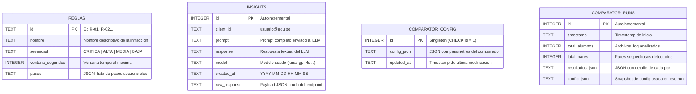
```mermaid
erDiagram
    REGLAS {
        TEXT id PK "Ej: R-01, R-02..."
        TEXT nombre "Nombre descriptivo de la infraccion"
        TEXT severidad "CRITICA | ALTA | MEDIA | BAJA"
        INTEGER ventana_segundos "Ventana temporal maxima"
        TEXT pasos "JSON: lista de pasos secuenciales"
    }

    INSIGHTS {
        INTEGER id PK "Autoincremental"
        TEXT client_id "usuario@equipo"
        TEXT prompt "Prompt completo enviado al LLM"
        TEXT response "Respuesta textual del LLM"
        TEXT model "Modelo usado (luna, gpt-4o...)"
        TEXT created_at "YYYY-MM-DD HH:MM:SS"
        TEXT raw_response "Payload JSON crudo del endpoint"
    }

    COMPARATOR_CONFIG {
        INTEGER id PK "Singleton (CHECK id = 1)"
        TEXT config_json "JSON con parametros del comparador"
        TEXT updated_at "Timestamp de ultima modificacion"
    }

    COMPARATOR_RUNS {
        INTEGER id PK "Autoincremental"
        TEXT timestamp "Timestamp de inicio"
        INTEGER total_alumnos "Archivos .log analizados"
        INTEGER total_pares "Pares sospechosos detectados"
        TEXT resultados_json "JSON con detalle de cada par"
        TEXT config_json "Snapshot de config usada en ese run"
    }
```

> [!NOTE]
> Las cuatro tablas son **independientes entre sí**: el esquema no define ninguna clave foránea. `reglas` la consume el motor de correlación (`LogCorrelator`) e `insights` la produce el módulo de IA (`AIInsight`) — pertenecen a subsistemas distintos y no comparten datos entre sí. Entre `comparator_config` y `comparator_runs` la ausencia de relación es deliberada: cada fila de `comparator_runs` guarda una *copia* (`config_json`) de la configuración vigente al momento de ejecutarse, no una referencia a `comparator_config.id`, de modo que el historial de ejecuciones queda inmutable aunque la configuración se modifique después. La vinculación conceptual entre alumnos, reglas aplicadas e insights generados ocurre a nivel de **archivos de log** (`datos_alumnos/*.log`, identificados por `client_id`), no a nivel relacional en SQLite — coherente con el ADR-003, que documenta la decisión de mantener la telemetría fuera de la base de datos.
>
> La telemetría cruda **no se almacena en SQLite**: se persiste como archivos `.log` individuales por alumno en `datos_alumnos/`, optimizando el rendimiento de escritura y permitiendo el análisis de archivos completos por los motores de correlación y comparación.

#### 5.2.2 Payload de Sincronización (`POST /sync`)

**Request** — `multipart/form-data`:

| Campo | Tipo | Requerido | Descripción |
|---|---|---|---|
| `client_id` | string (form field) | Sí | Identidad del alumno, formato `usuario@equipo` |
| `estado_local` | string (form field) | Sí | `"ESPERANDO"`, `"GRABANDO"` o `"FINALIZADO"` |
| `timestamp` | string (form field) | Sí | Timestamp ISO del agente `%Y-%m-%dT%H:%M:%S` |
| `alertas` | string (form field) | No | JSON serializado: `[{"timestamp": ..., "nivel": ..., "mensaje": ...}]` |
| `configs` | string (form field) | No | JSON con configuraciones locales del agente |
| `archivo_log` | file (upload) | No | `combined_log.log` — log unificado de todos los módulos |

**Response** — `application/json`:

```json
{
  "comando_global": "GRABANDO",
  "configuraciones": {
    "program_monitor": {"enabled": "true", "poll_seconds": "0.5"},
    "sniffer": {"enabled": "true"}
  }
}
```

#### 5.2.3 Formato de Log de Telemetría

Cada línea del archivo `.log` sigue el formato estandarizado:

```
[{timestamp_ISO}][{Nombre del Módulo}] {contenido_del_evento}
```

**Ejemplos por módulo:**

```log
[2026-09-24T14:30:05][Program Monitor] CONTEXT_CHANGE app='chrome.exe' title='ChatGPT — Google Chrome'
[2026-09-24T14:30:07][Sniffer] DNS Query: chatgpt.com → 104.18.32.7
[2026-09-24T14:30:08][Keylogger] [CTRL]+c
[2026-09-24T14:30:10][Paperclip] CLIPBOARD_CHANGED contenido='def fibonacci(n):...'
[2026-09-24T14:30:12][Keylogger] [CTRL]+v
[2026-09-24T14:30:15][Auditoria Python] [CRASH DETECTADO] NameError: name 'fib' is not defined
[2026-09-24T14:30:20][USB Detection] ALERTA_USB Dispositivo=Pendrive (Kingston DT) | Archivo=E:\respuestas.py | Accion=ARCHIVO CREADO | Proceso=explorer.exe
[2026-09-24T14:30:25][Keystrokes SVM] ANOMALIA distancia=-0.342 anomalias=16/60 (26.7%)
```

#### 5.2.4 Estructura de Reglas de Correlación (`reglas.json`)

```json
[
  {
    "id": "R-01",
    "nombre": "Consulta a IA y Pegado de Código",
    "severidad": "CRÍTICA",
    "ventana_segundos": 60,
    "pasos": [
      {"modulo": "paperclip", "patron": "CLIPBOARD_CHANGED"},
      {"modulo": "program_monitor", "patron": "CONTEXT_CHANGE.*app='(firefox|chrome|msedge)'"},
      {"modulo": "sniffer", "patron": "gemini\\.google\\.com|chatgpt\\.com|claude\\.ai|deepseek"},
      {"modulo": "keylogger", "patron": "\\[CTRL\\]\\+v"}
    ]
  },
  {
    "id": "R-02",
    "nombre": "Copia a Portapapeles y Acceso a IA/Web",
    "severidad": "ALTA",
    "ventana_segundos": 45,
    "pasos": [
      {"modulo": "paperclip", "patron": "CLIPBOARD_CHANGED"},
      {"modulo": "sniffer", "patron": "chatgpt\\.com|gemini\\.google\\.com|claude\\.ai"}
    ]
  },
  {
    "id": "R-03",
    "nombre": "Exfiltración vía Portapapeles a Mensajería",
    "severidad": "ALTA",
    "ventana_segundos": 30,
    "pasos": [
      {"modulo": "paperclip", "patron": "CLIPBOARD_CHANGED"},
      {"modulo": "sniffer", "patron": "discord\\.com|miro\\.com|chat\\.google\\.com|telegram|whatsapp"}
    ]
  },
  {
    "id": "R-04",
    "nombre": "Crash en Código seguido de Búsqueda Externa",
    "severidad": "MEDIA",
    "ventana_segundos": 60,
    "pasos": [
      {"modulo": "error_detection", "patron": "CRASH DETECTADO"},
      {"modulo": "paperclip", "patron": "CLIPBOARD_CHANGED"},
      {"modulo": "program_monitor", "patron": "CONTEXT_CHANGE.*app='(firefox|chrome|msedge)'"},
      {"modulo": "sniffer", "patron": "gemini\\.google\\.com|chatgpt\\.com|claude\\.ai|deepseek"},
      {"modulo": "keylogger", "patron": "\\[CTRL\\]\\+v"}
    ]
  },
  {
    "id": "R-05",
    "nombre": "Desvío a Navegador Externo durante Ejecución",
    "severidad": "MEDIA",
    "ventana_segundos": 30,
    "pasos": [
      {"modulo": "paperclip", "patron": "CLIPBOARD_CHANGED"},
      {"modulo": "program_monitor", "patron": "CONTEXT_CHANGE.*app='(firefox|chrome|msedge)'"},
      {"modulo": "keylogger", "patron": "\\[CTRL\\]\\+v"}
    ]
  },
  {
    "id": "R-06",
    "nombre": "Acceso a Dispositivo USB o Celular",
    "severidad": "CRÍTICA",
    "ventana_segundos": 60,
    "pasos": [
      {"modulo": "usb_detection", "patron": "ALERTA_USB"}
    ]
  },
  {
    "id": "R-07",
    "nombre": "Copia de Archivo desde USB y Pegado de Código",
    "severidad": "CRÍTICA",
    "ventana_segundos": 60,
    "pasos": [
      {"modulo": "usb_detection", "patron": "ALERTA_USB"},
      {"modulo": "keylogger", "patron": "\\[CTRL\\]\\+v"}
    ]
  }
]
```

#### 5.2.5 Parámetros del Comparador Multiseñal

| Parámetro | Default | Rango | Descripción |
|---|---|---|---|
| `intervalo_segundos` | `60` | $\geq 0$ | Frecuencia de ejecución automática |
| `auto_analisis` | `true` | bool | Habilita scheduler en background |
| `k_shingle` | `5` | 1–20 | Tamaño del n-grama para MinHash |
| `num_perm` | `128` | 16–512 | Permutaciones MinHash (precisión vs memoria) |
| `ventana_sincronia_seg` | `8` | 1–120 | Margen temporal para sincronía de fugas/ejecuciones |
| `umbral_codigo` | `0.35` | 0.0–1.0 | Umbral Jaccard para LSH |
| `umbral_portapapeles` | `0.50` | 0.0–1.0 | Umbral de similitud para portapapeles |
| `apps_permitidas` | `"code, python, pythonw"` | CSV | Whitelist de ejecutables durante el examen |
| `titulos_permitidos` | `"integri-ti"` | CSV | Whitelist de palabras en títulos de ventana |
| `peso_codigo` | `0.45` | 0.0–1.0 | Peso de la similitud de código (Jaccard) en el score compuesto |
| `peso_portapapeles` | `0.35` | 0.0–1.0 | Peso de la similitud de portapapeles en el score compuesto |
| `peso_fugas` | `0.15` | 0.0–1.0 | Peso de la sincronía de fugas de contexto en el score compuesto |
| `peso_ejecucion` | `0.05` | 0.0–1.0 | Peso de la sincronía de ejecución en el score compuesto |
| `boost_clip_umbral` | `0.85` | 0.0–1.0 | Umbral de similitud de portapapeles que activa la escalación de severidad |
| `boost_clip_exec_score` | `0.70` | 0.0–1.0 | Score mínimo garantizado si portapapeles alto **y** ejecución sincronizada |
| `boost_clip_score` | `0.50` | 0.0–1.0 | Score mínimo garantizado si solo el portapapeles es alto |
| `umbral_critico_score` | `0.55` | 0.0–1.0 | Score compuesto mínimo para clasificar como CRÍTICO |
| `umbral_critico_jaccard` | `0.65` | 0.0–1.0 | Similitud de código que fuerza clasificación CRÍTICO |
| `umbral_alto_score` | `0.35` | 0.0–1.0 | Score compuesto mínimo para clasificar como ALTO |
| `umbral_alto_jaccard` | `0.45` | 0.0–1.0 | Similitud de código que fuerza clasificación ALTO |
| `umbral_alto_clip` | `0.70` | 0.0–1.0 | Similitud de portapapeles que fuerza clasificación ALTO |

> [!NOTE]
> Todos los parámetros de esta tabla — incluidos los pesos del score compuesto y los umbrales de escalación/severidad — se almacenan como un único registro en `comparator_config.config_json` y son ajustables por el profesor desde el dashboard; los valores mostrados son los definidos en `CONFIG_DEFAULT`, no constantes fijas en el código de `comparator.py`.

### 5.3 Protocolos de Comunicación y Seguridad

#### 5.3.1 Protocolo de Comunicación

**Agente de Telemetría ↔ Servidor**

| Aspecto | Especificación |
|---|---|
| **Protocolo de transporte** | HTTP/1.1 |
| **Formato del payload de telemetría** | `multipart/form-data` (campos de texto + archivo de log) |
| **Formato de respuestas API** | `application/json` |
| **Patrón de comunicación** | Polling (cliente → servidor) cada 15 segundos (configurable) |
| **Puerto** | 8000 (TCP) |
| **Descubrimiento** | Escaneo automático de subred con `ThreadPoolExecutor(max_workers=100)` |
| **Tolerancia a fallos** | 3 reintentos fallidos consecutivos → reset + redescubrimiento de servidor |

**Servidor ↔ Dashboard (Navegador del Profesor)**

| Aspecto | Especificación |
|---|---|
| **Protocolo de transporte** | HTTP/1.1 |
| **Formato de respuestas** | `application/json` (endpoints de estado) / HTML renderizado (Jinja2, vistas del dashboard) |
| **Puerto** | 8000 (TCP) — mismo servidor, sin puerto dedicado |
| **Patrón de comunicación** | Polling (navegador → servidor) cada 2 segundos vía `GET /api/status` |

#### 5.3.2 Flujo de Comunicación del Agente

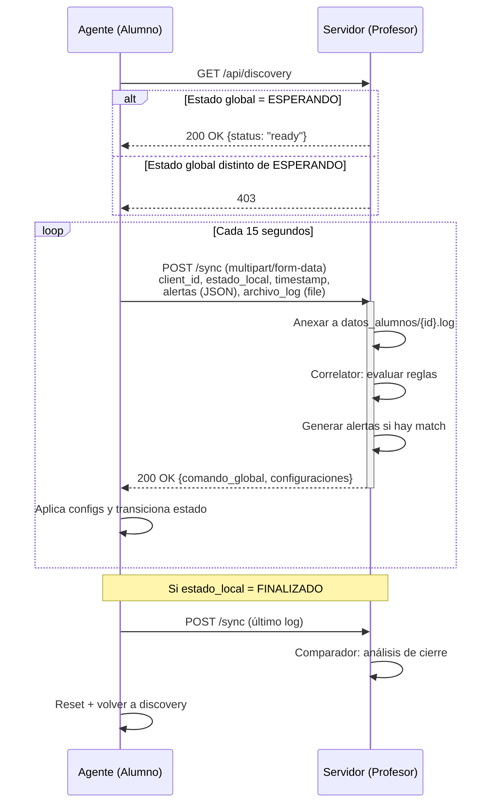
```mermaid
sequenceDiagram
    participant Agente as Agente (Alumno)
    participant Servidor as Servidor (Profesor)

    Agente->>Servidor: GET /api/discovery
    alt Estado global = ESPERANDO
        Servidor-->>Agente: 200 OK {status: "ready"}
    else Estado global distinto de ESPERANDO
        Servidor-->>Agente: 403
    end

    loop Cada 15 segundos
        Agente->>Servidor: POST /sync (multipart/form-data)<br/>client_id, estado_local, timestamp,<br/>alertas (JSON), archivo_log (file)
        activate Servidor
        Servidor->>Servidor: Anexar a datos_alumnos/{id}.log
        Servidor->>Servidor: Correlator: evaluar reglas
        Servidor->>Servidor: Generar alertas si hay match
        Servidor-->>Agente: 200 OK {comando_global, configuraciones}
        deactivate Servidor
        Agente->>Agente: Aplica configs y transiciona estado
    end

    Note over Agente,Servidor: Si estado_local = FINALIZADO
    Agente->>Servidor: POST /sync (último log)
    Servidor->>Servidor: Comparador: análisis de cierre
    Agente->>Agente: Reset + volver a discovery
```

#### 5.3.3 Mecanismos de Seguridad

| Aspecto | Estado Actual | Descripción |
|---|---|---|
| **Control de admisión** | ✅ Implementado | `/api/discovery` rechaza conexiones (HTTP 403) si el examen ya inició (`GRABANDO`) o finalizó (`FINALIZADO`) |
| **Ejecución sigilosa (Windows)** | ✅ Implementado | El agente usa `pythonw.exe` + tarea programada oculta. No hay ventana de consola visible para el alumno |
| **Persistencia ante reinicios** | ✅ Implementado | Servicio systemd (Linux) y tarea programada AtLogOn (Windows) |
| **Privilegios elevados** | ✅ Implementado | Elevación automática UAC (Windows) y sudo NOPASSWD (Linux) |
| **Bypass Wayland** | ✅ Implementado | El instalador de Linux fuerza Xorg para permitir captura de eventos globales |
| **CORS** | ⚠️ Permisivo | `allow_origins=["*"]` — aceptable en red local de aula |
| **Autenticación del dashboard** | ❌ No implementada | Sin login para el panel del profesor |
| **Cifrado en tránsito** | ❌ No implementado | HTTP plano (diseñado para LANs educativas aisladas) |
| **Autenticación de agentes** | ❌ No implementada | Cualquier equipo en la red puede conectarse como agente |
| **API de IA** | ✅ Implementado | Autenticación Bearer Token cargada desde `.env` |

> [!CAUTION]
> El sistema está diseñado para operar en **redes locales de aula aisladas**. Si se despliega en redes abiertas o a través de internet, se debe implementar HTTPS con certificados TLS, autenticación del dashboard, y registro de agentes con pre-autorización.

---

## 6. Flujos e Interacción

### 6.1 Diagramas de Flujo Algorítmico por Módulo

#### 6.1.1 Flujo del Agente de Telemetría (Máquina de Estados)

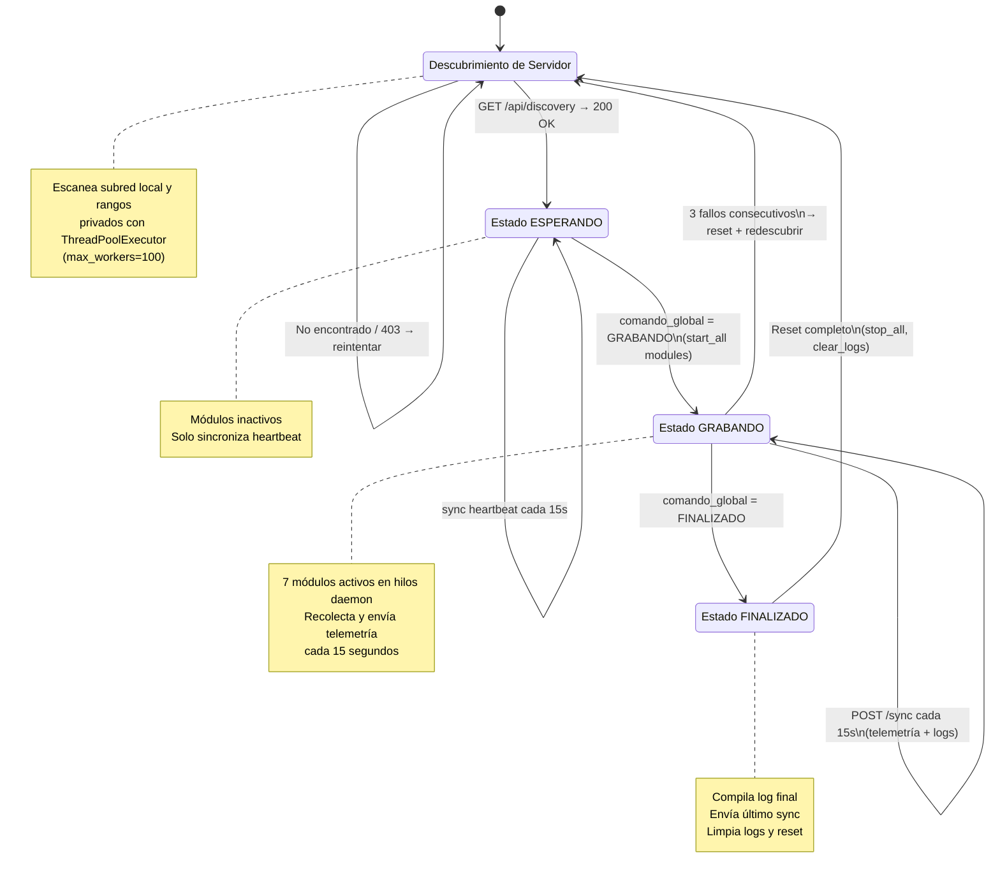
```mermaid
stateDiagram-v2
    [*] --> Descubrimiento

    Descubrimiento: Descubrimiento de Servidor
    note right of Descubrimiento
        Escanea subred local y rangos
        privados con ThreadPoolExecutor
        (max_workers=100)
    end note

    Esperando: Estado ESPERANDO
    note right of Esperando
        Módulos inactivos
        Solo sincroniza heartbeat
    end note

    Grabando: Estado GRABANDO
    note right of Grabando
        7 módulos activos en hilos daemon
        Recolecta y envía telemetría
        cada 15 segundos
    end note

    Finalizado: Estado FINALIZADO
    note right of Finalizado
        Compila log final
        Envía último sync
        Limpia logs y reset
    end note

    Descubrimiento --> Esperando: GET /api/discovery → 200 OK
    Descubrimiento --> Descubrimiento: No encontrado / 403 → reintentar

    Esperando --> Grabando: comando_global = GRABANDO\n(start_all modules)
    Esperando --> Esperando: sync heartbeat cada 15s

    Grabando --> Grabando: POST /sync cada 15s\n(telemetría + logs)
    Grabando --> Finalizado: comando_global = FINALIZADO

    Finalizado --> Descubrimiento: Reset completo\n(stop_all, clear_logs)

    Grabando --> Descubrimiento: 3 fallos consecutivos\n→ reset + redescubrir
```

#### 6.1.2 Flujo del Orquestador de Módulos (Orchestrator)

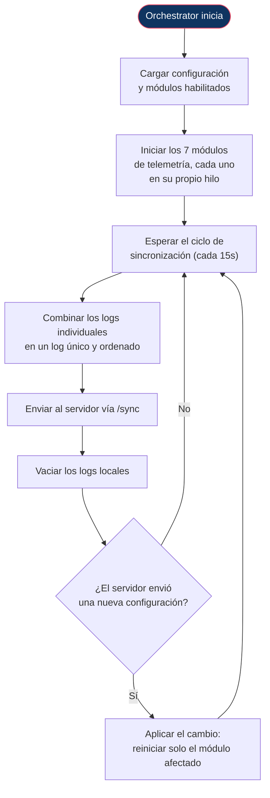
```mermaid
flowchart TD
    Init(["Orchestrator inicia"]) --> Load["Cargar configuración<br/>y módulos habilitados"]
    Load --> Start["Iniciar los 7 módulos<br/>de telemetría, cada uno<br/>en su propio hilo"]
    Start --> Wait["Esperar el ciclo de<br/>sincronización (cada 15s)"]
    Wait --> Merge["Combinar los logs individuales<br/>en un log único y ordenado"]
    Merge --> Send["Enviar al servidor vía /sync"]
    Send --> Clear["Vaciar los logs locales"]
    Clear --> CheckConfig{"¿El servidor envió<br/>una nueva configuración?"}
    CheckConfig -->|No| Wait
    CheckConfig -->|Sí| Apply["Aplicar el cambio:<br/>reiniciar solo el módulo afectado"]
    Apply --> Wait

    style Init fill:#0f3460,stroke:#e94560,color:#fff
```

#### 6.1.3 Flujo del Program Monitor

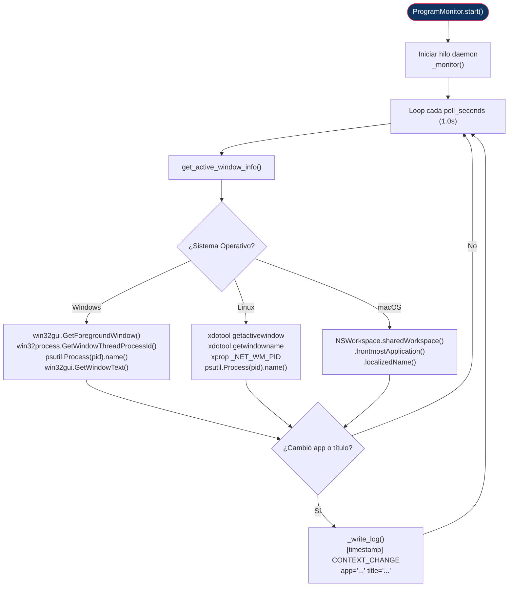
```mermaid
flowchart TD
    Start(["ProgramMonitor.start()"]) --> Thread["Iniciar hilo daemon<br/>_monitor()"]
    Thread --> Loop["Loop cada poll_seconds (1.0s)"]
    Loop --> GetWindow["get_active_window_info()"]
    GetWindow --> DetectOS{¿Sistema Operativo?}

    DetectOS -->|Windows| Win["win32gui.GetForegroundWindow()<br/>win32process.GetWindowThreadProcessId()<br/>psutil.Process(pid).name()<br/>win32gui.GetWindowText()"]
    DetectOS -->|Linux| Lin["xdotool getactivewindow<br/>xdotool getwindowname<br/>xprop _NET_WM_PID<br/>psutil.Process(pid).name()"]
    DetectOS -->|macOS| Mac["NSWorkspace.sharedWorkspace()<br/>.frontmostApplication()<br/>.localizedName()"]

    Win --> Compare
    Lin --> Compare
    Mac --> Compare

    Compare{"¿Cambió app o título?"}
    Compare -->|No| Loop
    Compare -->|Sí| WriteLog["_write_log()<br/>[timestamp] CONTEXT_CHANGE<br/>app='...' title='...'"]
    WriteLog --> Loop

    style Start fill:#0f3460,stroke:#e94560,color:#fff
```

#### 6.1.4 Flujo del Keylogger

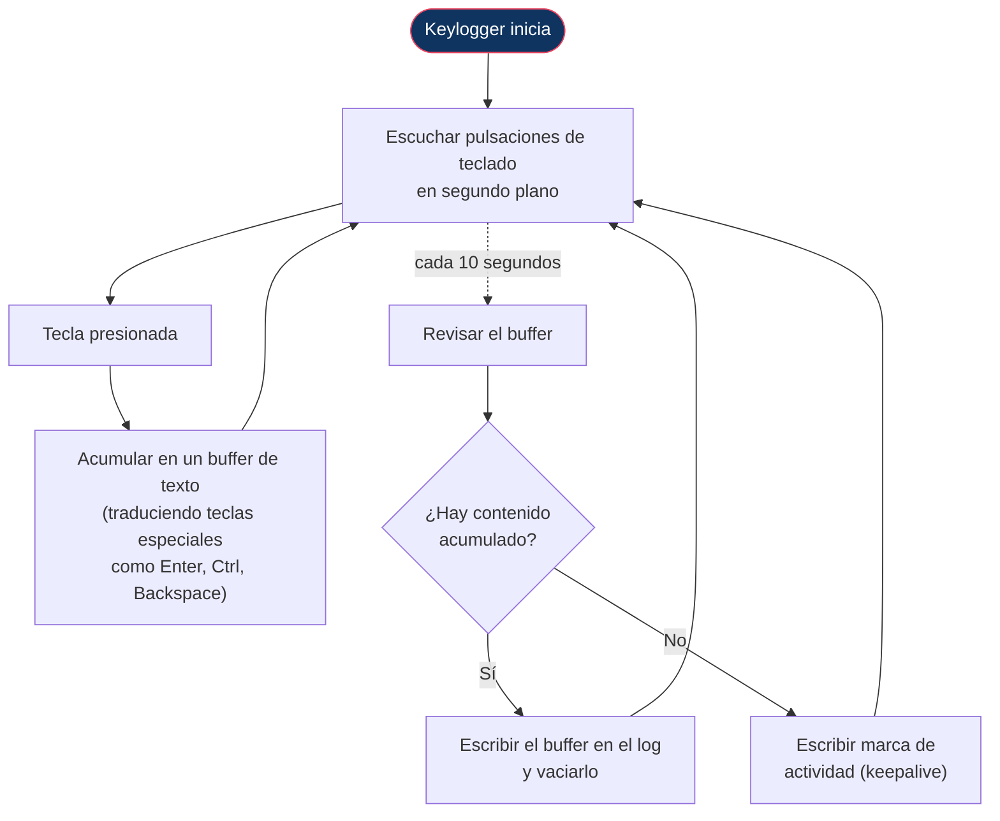
```mermaid
flowchart TD
    Start(["Keylogger inicia"]) --> Listen["Escuchar pulsaciones de teclado<br/>en segundo plano"]
    Listen --> Key["Tecla presionada"]
    Key --> Buffer["Acumular en un buffer de texto<br/>(traduciendo teclas especiales<br/>como Enter, Ctrl, Backspace)"]
    Buffer --> Listen
    Listen -.->|"cada 10 segundos"| Timer["Revisar el buffer"]
    Timer --> Check{"¿Hay contenido<br/>acumulado?"}
    Check -->|Sí| WriteLog["Escribir el buffer en el log<br/>y vaciarlo"]
    Check -->|No| Heartbeat["Escribir marca de<br/>actividad (keepalive)"]
    WriteLog --> Listen
    Heartbeat --> Listen

    style Start fill:#0f3460,stroke:#e94560,color:#fff
```

#### 6.1.5 Flujo del Sniffer de Red

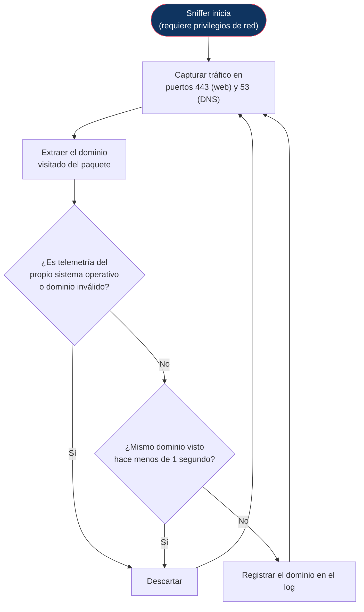
```mermaid
flowchart TD
    Start(["Sniffer inicia<br/>(requiere privilegios de red)"]) --> Capture["Capturar tráfico en<br/>puertos 443 (web) y 53 (DNS)"]
    Capture --> Extract["Extraer el dominio<br/>visitado del paquete"]
    Extract --> Filter{"¿Es telemetría del<br/>propio sistema operativo<br/>o dominio inválido?"}
    Filter -->|Sí| Discard["Descartar"]
    Filter -->|No| Dedup{"¿Mismo dominio visto<br/>hace menos de 1 segundo?"}
    Dedup -->|Sí| Discard
    Dedup -->|No| WriteLog["Registrar el dominio en el log"]
    Discard --> Capture
    WriteLog --> Capture

    style Start fill:#0f3460,stroke:#e94560,color:#fff
```

#### 6.1.6 Flujo del Monitor de Portapapeles (Paperclip)

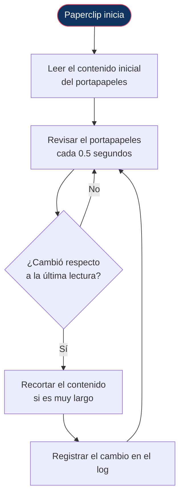
```mermaid
flowchart TD
    Start(["Paperclip inicia"]) --> Seed["Leer el contenido inicial<br/>del portapapeles"]
    Seed --> Loop["Revisar el portapapeles<br/>cada 0.5 segundos"]
    Loop --> Compare{"¿Cambió respecto<br/>a la última lectura?"}
    Compare -->|No| Loop
    Compare -->|Sí| Truncate["Recortar el contenido<br/>si es muy largo"]
    Truncate --> WriteLog["Registrar el cambio en el log"]
    WriteLog --> Loop

    style Start fill:#0f3460,stroke:#e94560,color:#fff
```

#### 6.1.7 Flujo de Detección de Errores en Ejecuciones Python (ErrorDetection)

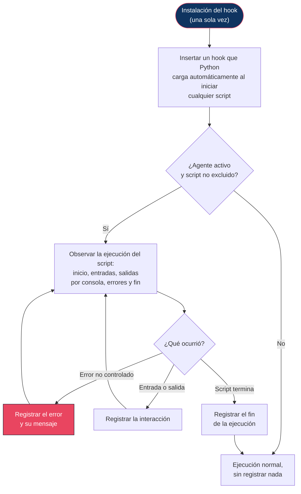
```mermaid
flowchart TD
    Install(["Instalación del hook<br/>(una sola vez)"]) --> Hook["Insertar un hook que Python<br/>carga automáticamente al iniciar<br/>cualquier script"]
    Hook --> Active{"¿Agente activo<br/>y script no excluido?"}
    Active -->|No| Ignore["Ejecución normal,<br/>sin registrar nada"]
    Active -->|Sí| Watch["Observar la ejecución del script:<br/>inicio, entradas, salidas<br/>por consola, errores y fin"]
    Watch --> Event{"¿Qué ocurrió?"}
    Event -->|Error no controlado| LogCrash["Registrar el error<br/>y su mensaje"]
    Event -->|Entrada o salida| LogIO["Registrar la interacción"]
    Event -->|Script termina| LogEnd["Registrar el fin<br/>de la ejecución"]
    LogCrash --> Watch
    LogIO --> Watch
    LogEnd --> Ignore

    style Install fill:#0f3460,stroke:#e94560,color:#fff
    style LogCrash fill:#e94560,stroke:#1a1a2e,color:#fff
```

#### 6.1.8 Flujo de la Biometría de Tecleo (KeystrokeSVM)

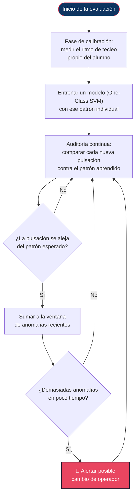
```mermaid
flowchart TD
    Start(["Inicio de la evaluación"]) --> Calibrate["Fase de calibración:<br/>medir el ritmo de tecleo<br/>propio del alumno"]
    Calibrate --> Train["Entrenar un modelo (One-Class SVM)<br/>con ese patrón individual"]
    Train --> Monitor["Auditoría continua:<br/>comparar cada nueva pulsación<br/>contra el patrón aprendido"]
    Monitor --> Classify{"¿La pulsación se aleja<br/>del patrón esperado?"}
    Classify -->|No| Monitor
    Classify -->|Sí| Count["Sumar a la ventana<br/>de anomalías recientes"]
    Count --> Threshold{"¿Demasiadas anomalías<br/>en poco tiempo?"}
    Threshold -->|No| Monitor
    Threshold -->|Sí| Alert["🚨 Alertar posible<br/>cambio de operador"]
    Alert --> Monitor

    style Start fill:#0f3460,stroke:#e94560,color:#fff
    style Alert fill:#e94560,stroke:#1a1a2e,color:#fff
```

#### 6.1.9 Flujo del USB Detection

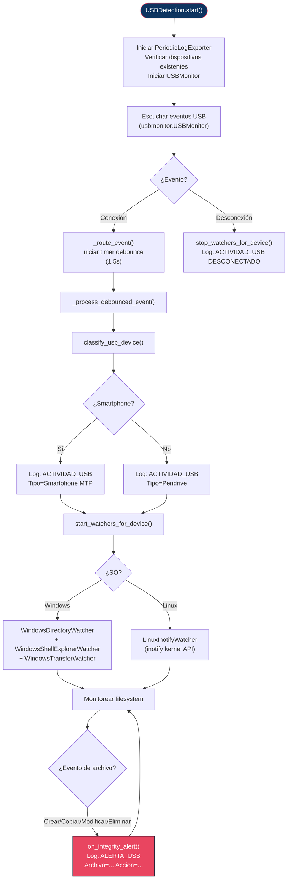
```mermaid
flowchart TD
    Start(["USBDetection.start()"]) --> Init["Iniciar PeriodicLogExporter<br/>Verificar dispositivos existentes<br/>Iniciar USBMonitor"]
    Init --> Listen["Escuchar eventos USB<br/>(usbmonitor.USBMonitor)"]

    Listen --> Event{¿Evento?}
    Event -->|Conexión| Route["_route_event()<br/>Iniciar timer debounce (1.5s)"]
    Event -->|Desconexión| StopWatch["stop_watchers_for_device()<br/>Log: ACTIVIDAD_USB DESCONECTADO"]

    Route --> Debounce["_process_debounced_event()"]
    Debounce --> Classify["classify_usb_device()"]
    Classify --> IsSmart{¿Smartphone?}

    IsSmart -->|Sí| LogSmart["Log: ACTIVIDAD_USB<br/>Tipo=Smartphone MTP"]
    IsSmart -->|No| LogPen["Log: ACTIVIDAD_USB<br/>Tipo=Pendrive"]

    LogSmart --> StartWatch["start_watchers_for_device()"]
    LogPen --> StartWatch

    StartWatch --> OSWatch{¿SO?}
    OSWatch -->|Windows| WinWatch["WindowsDirectoryWatcher<br/>+ WindowsShellExplorerWatcher<br/>+ WindowsTransferWatcher"]
    OSWatch -->|Linux| LinWatch["LinuxInotifyWatcher<br/>(inotify kernel API)"]

    WinWatch --> Monitor["Monitorear filesystem"]
    LinWatch --> Monitor

    Monitor --> FileEvent{¿Evento de archivo?}
    FileEvent -->|Crear/Copiar/Modificar/Eliminar| Alert["on_integrity_alert()<br/>Log: ALERTA_USB<br/>Archivo=... Accion=..."]
    Alert --> Monitor

    style Start fill:#0f3460,stroke:#e94560,color:#fff
    style Alert fill:#e94560,stroke:#1a1a2e,color:#fff
```

#### 6.1.10 Flujo del Motor de Correlación (Servidor)

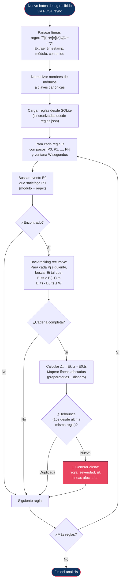
```mermaid
flowchart TD
    Recv(["Nuevo batch de log recibido<br/>via POST /sync"]) --> Parse["Parsear líneas:<br/>regex ^\\[(.*)\\]\\[(.*)\\]\\s*(.*)$<br/>Extraer timestamp, módulo, contenido"]
    Parse --> Normalize["Normalizar nombres de módulos<br/>a claves canónicas"]
    Normalize --> LoadRules["Cargar reglas desde SQLite<br/>(sincronizadas desde reglas.json)"]

    LoadRules --> ForEachRule["Para cada regla R<br/>con pasos [P0, P1, ..., Pk]<br/>y ventana W segundos"]

    ForEachRule --> FindP0["Buscar evento E0<br/>que satisfaga P0<br/>(módulo + regex)"]
    FindP0 --> FoundP0{¿Encontrado?}
    FoundP0 -->|No| NextRule["Siguiente regla"]
    FoundP0 -->|Sí| Backtrack["Backtracking recursivo:<br/>Para cada Pj siguiente,<br/>buscar Ei tal que:<br/>Ei.ts ≥ E(j-1).ts<br/>Ei.ts - E0.ts ≤ W"]

    Backtrack --> Complete{¿Cadena completa?}
    Complete -->|No| NextRule
    Complete -->|Sí| CalcDelta["Calcular Δt = Ek.ts - E0.ts<br/>Mapear líneas afectadas<br/>(preparatorias + disparo)"]
    CalcDelta --> Debounce{"¿Debounce<br/>(15s desde última<br/>misma regla)?"}
    Debounce -->|Duplicada| NextRule
    Debounce -->|Nueva| GenAlert["🚨 Generar alerta:<br/>regla, severidad, Δt,<br/>líneas afectadas"]
    GenAlert --> NextRule

    NextRule --> Done{¿Más reglas?}
    Done -->|Sí| ForEachRule
    Done -->|No| End(["Fin del análisis"])

    style Recv fill:#0f3460,stroke:#e94560,color:#fff
    style GenAlert fill:#e94560,stroke:#1a1a2e,color:#fff
    style End fill:#0f3460,stroke:#e94560,color:#fff
```

#### 6.1.11 Flujo del Comparador Multiseñal (Servidor)

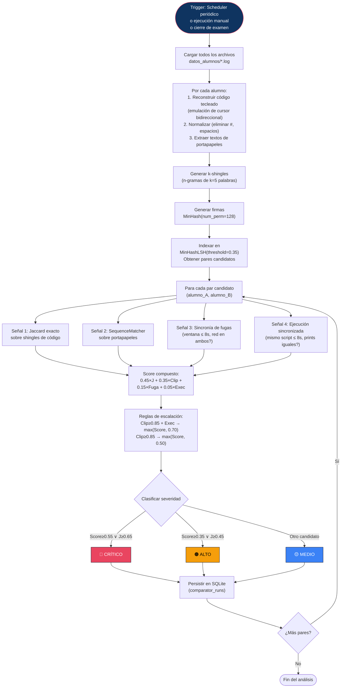
```mermaid
flowchart TD
    Trigger(["Trigger: Scheduler periódico<br/>o ejecución manual<br/>o cierre de examen"]) --> LoadLogs["Cargar todos los archivos<br/>datos_alumnos/*.log"]

    LoadLogs --> Reconstruct["Por cada alumno:<br/>1. Reconstruir código tecleado<br/>(emulación de cursor bidireccional)<br/>2. Normalizar (eliminar #, espacios)<br/>3. Extraer textos de portapapeles"]

    Reconstruct --> Shingle["Generar k-shingles<br/>(n-gramas de k=5 palabras)"]
    Shingle --> MinHash["Generar firmas<br/>MinHash(num_perm=128)"]
    MinHash --> LSH["Indexar en<br/>MinHashLSH(threshold=0.35)<br/>Obtener pares candidatos"]

    LSH --> ForPair["Para cada par candidato<br/>(alumno_A, alumno_B)"]

    ForPair --> Signal1["Señal 1: Jaccard exacto<br/>sobre shingles de código"]
    ForPair --> Signal2["Señal 2: SequenceMatcher<br/>sobre portapapeles"]
    ForPair --> Signal3["Señal 3: Sincronía de fugas<br/>(ventana ≤ 8s, red en ambos?)"]
    ForPair --> Signal4["Señal 4: Ejecución sincronizada<br/>(mismo script ≤ 8s, prints iguales?)"]

    Signal1 --> Score["Score compuesto:<br/>0.45×J + 0.35×Clip +<br/>0.15×Fuga + 0.05×Exec"]
    Signal2 --> Score
    Signal3 --> Score
    Signal4 --> Score

    Score --> Escalation["Reglas de escalación:<br/>Clip≥0.85 + Exec → max(Score, 0.70)<br/>Clip≥0.85 → max(Score, 0.50)"]

    Escalation --> Classify{"Clasificar severidad"}
    Classify -->|"Score≥0.55 ∨ J≥0.65"| Critical["🔴 CRÍTICO"]
    Classify -->|"Score≥0.35 ∨ J≥0.45"| High["🟠 ALTO"]
    Classify -->|"Otro candidato"| Medium["🟡 MEDIO"]

    Critical --> Store["Persistir en SQLite<br/>(comparator_runs)"]
    High --> Store
    Medium --> Store
    Store --> NextPair{¿Más pares?}
    NextPair -->|Sí| ForPair
    NextPair -->|No| End(["Fin del análisis"])

    style Trigger fill:#0f3460,stroke:#e94560,color:#fff
    style Critical fill:#e94560,stroke:#1a1a2e,color:#fff
    style High fill:#f59e0b,stroke:#1a1a2e,color:#000
    style Medium fill:#3b82f6,stroke:#1a1a2e,color:#fff
```

#### 6.1.12 Flujo del Análisis Pedagógico Asistido por IA (AIInsight)

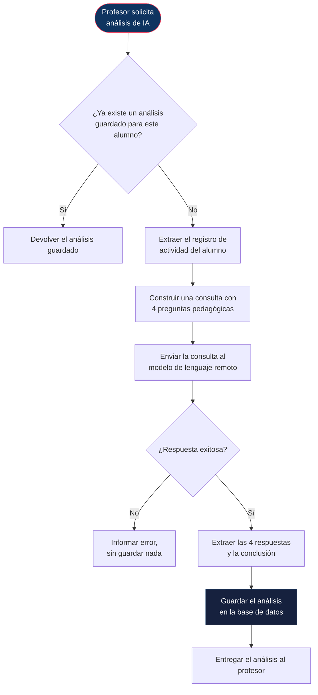
```mermaid
flowchart TD
    Trigger(["Profesor solicita<br/>análisis de IA"]) --> Cached{"¿Ya existe un análisis<br/>guardado para este alumno?"}
    Cached -->|Sí| ReturnCache["Devolver el análisis guardado"]
    Cached -->|No| Context["Extraer el registro de<br/>actividad del alumno"]
    Context --> Prompt["Construir una consulta con<br/>4 preguntas pedagógicas"]
    Prompt --> Call["Enviar la consulta al<br/>modelo de lenguaje remoto"]
    Call --> Ok{"¿Respuesta exitosa?"}
    Ok -->|No| Error["Informar error,<br/>sin guardar nada"]
    Ok -->|Sí| Parse["Extraer las 4 respuestas<br/>y la conclusión"]
    Parse --> Save["Guardar el análisis<br/>en la base de datos"]
    Save --> Return["Entregar el análisis al profesor"]

    style Trigger fill:#0f3460,stroke:#e94560,color:#fff
    style Save fill:#16213e,stroke:#0f3460,color:#fff
```

### 6.2 Diagramas de Secuencia y Flujo de Datos

#### 6.2.1 Secuencia Completa: Ciclo de Vida de un Examen

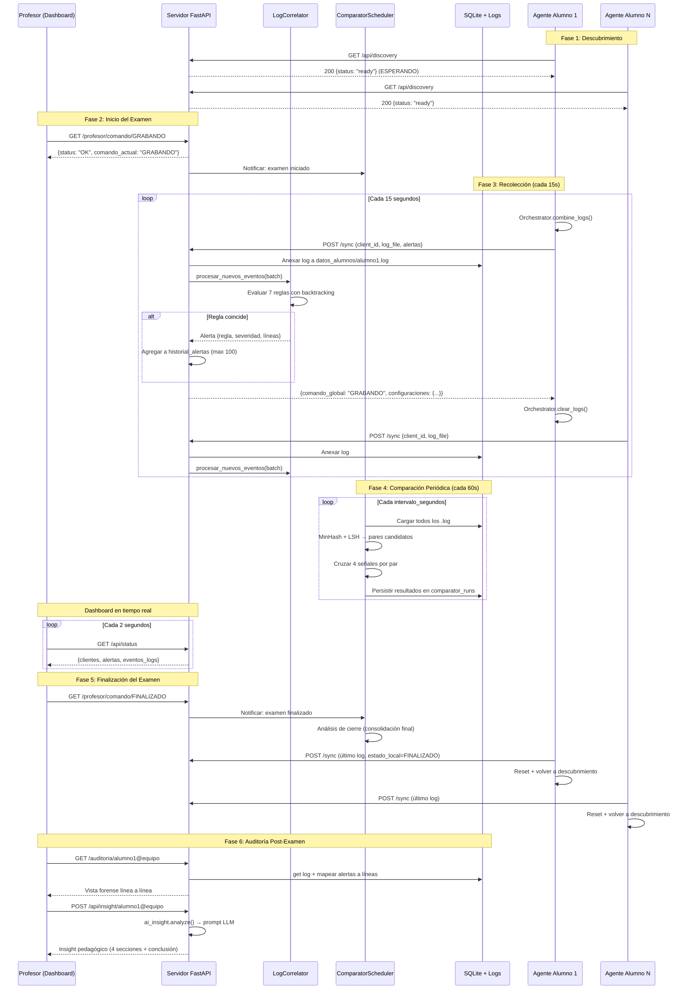
```mermaid
sequenceDiagram
    participant Prof as Profesor (Dashboard)
    participant Srv as Servidor FastAPI
    participant Corr as LogCorrelator
    participant Comp as ComparatorScheduler
    participant DB as SQLite + Logs
    participant A1 as Agente Alumno 1
    participant A2 as Agente Alumno N

    Note over A1,A2: Fase 1: Descubrimiento
    A1->>Srv: GET /api/discovery
    Srv-->>A1: 200 {status: "ready"} (ESPERANDO)
    A2->>Srv: GET /api/discovery
    Srv-->>A2: 200 {status: "ready"}

    Note over Prof,Srv: Fase 2: Inicio del Examen
    Prof->>Srv: GET /profesor/comando/GRABANDO
    Srv-->>Prof: {status: "OK", comando_actual: "GRABANDO"}
    Srv->>Comp: Notificar: examen iniciado

    Note over A1,DB: Fase 3: Recolección (cada 15s)
    loop Cada 15 segundos
        A1->>A1: Orchestrator.combine_logs()
        A1->>Srv: POST /sync {client_id, log_file, alertas}
        Srv->>DB: Anexar log a datos_alumnos/alumno1.log
        Srv->>Corr: procesar_nuevos_eventos(batch)
        Corr->>Corr: Evaluar 7 reglas con backtracking
        alt Regla coincide
            Corr-->>Srv: Alerta {regla, severidad, líneas}
            Srv->>Srv: Agregar a historial_alertas (max 100)
        end
        Srv-->>A1: {comando_global: "GRABANDO", configuraciones: {...}}
        A1->>A1: Orchestrator.clear_logs()

        A2->>Srv: POST /sync {client_id, log_file}
        Srv->>DB: Anexar log
        Srv->>Corr: procesar_nuevos_eventos(batch)
    end

    Note over Comp,DB: Fase 4: Comparación Periódica (cada 60s)
    loop Cada intervalo_segundos
        Comp->>DB: Cargar todos los .log
        Comp->>Comp: MinHash + LSH → pares candidatos
        Comp->>Comp: Cruzar 4 señales por par
        Comp->>DB: Persistir resultados en comparator_runs
    end

    Note over Prof,Srv: Dashboard en tiempo real
    loop Cada 2 segundos
        Prof->>Srv: GET /api/status
        Srv-->>Prof: {clientes, alertas, eventos_logs}
    end

    Note over Prof,Srv: Fase 5: Finalización del Examen
    Prof->>Srv: GET /profesor/comando/FINALIZADO
    Srv->>Comp: Notificar: examen finalizado
    Comp->>Comp: Análisis de cierre (consolidación final)

    A1->>Srv: POST /sync (último log, estado_local=FINALIZADO)
    A1->>A1: Reset + volver a descubrimiento
    A2->>Srv: POST /sync (último log)
    A2->>A2: Reset + volver a descubrimiento

    Note over Prof,DB: Fase 6: Auditoría Post-Examen
    Prof->>Srv: GET /auditoria/alumno1@equipo
    Srv->>DB: get log + mapear alertas a líneas
    Srv-->>Prof: Vista forense línea a línea

    Prof->>Srv: POST /api/insight/alumno1@equipo
    Srv->>Srv: ai_insight.analyze() → prompt LLM
    Srv-->>Prof: Insight pedagógico (4 secciones + conclusión)
```

#### 6.2.2 Flujo de Datos Completo del Sistema

```mermaid
flowchart LR
    subgraph "Estaciones de Alumnos"
        E1["💻 Alumno 1"]
        E2["💻 Alumno 2"]
        EN["💻 Alumno N"]
    end

    subgraph "7 Módulos de Captura"
        PM["Procesos<br/>(win32gui/xdotool)"]
        KL["Teclado<br/>(pynput)"]
        SN["Red<br/>(scapy)"]
        PP["Portapapeles<br/>(pyperclip)"]
        ED["Errores Python<br/>(subprocess)"]
        SVM["Biometría<br/>(scikit-learn)"]
        USB["USB/MTP<br/>(usbmonitor/inotify/Win32)"]
    end

    subgraph "Transmisión"
        SYNC["POST /sync<br/>multipart/form-data<br/>cada 15 segundos"]
    end

    subgraph "Procesamiento en Servidor"
        STORE["📁 datos_alumnos/<br/>Almacenamiento<br/>de logs crudos"]
        CORR["🔗 Correlador<br/>Backtracking<br/>secuencial temporal"]
        COMP["📊 Comparador<br/>MinHash/LSH<br/>4 señales"]
        AI["🤖 AI Insight<br/>Análisis pedagógico<br/>LLM"]
    end

    subgraph "Salida al Profesor"
        DASH["📊 Dashboard<br/>Monitoreo en vivo<br/>(refresh 2s)"]
        ALERT["🚨 Alertas<br/>Severidad:<br/>Crítica/Alta/Media"]
        AUDIT["📋 Auditoría<br/>Forense línea<br/>a línea"]
        PAIRS["👥 Pares<br/>Sospechosos<br/>con score"]
        INSIGHT["💡 Insight<br/>Pedagógico IA<br/>4 secciones"]
    end

    E1 --> PM & KL & SN & PP & ED & SVM & USB
    E2 --> PM & KL & SN & PP & ED & SVM & USB
    EN --> PM & KL & SN & PP & ED & SVM & USB

    PM & KL & SN & PP & ED & SVM & USB --> SYNC
    SYNC --> STORE

    STORE --> CORR
    STORE --> COMP
    STORE --> AI

    CORR --> ALERT
    COMP --> PAIRS
    AI --> INSIGHT
    STORE --> AUDIT

    ALERT --> DASH
    PAIRS --> DASH
    AUDIT --> DASH

    style ALERT fill:#e94560,stroke:#1a1a2e,color:#fff
    style PAIRS fill:#f59e0b,stroke:#1a1a2e,color:#000
    style DASH fill:#0f3460,stroke:#e94560,color:#fff
    style INSIGHT fill:#533483,stroke:#e94560,color:#fff
```

---

## 7. Testing

### 7.1 Estrategia Preliminar de Pruebas Unitarias

#### 7.1.1 Alcance

Las pruebas unitarias se enfocan en los componentes más críticos del sistema: la **recolección y transmisión de datos de telemetría** (cliente), y los **motores de análisis** (servidor).

#### 7.1.2 Framework y Herramientas

| Herramienta | Propósito |
|---|---|
| `pytest` | Framework de pruebas |
| `pytest-asyncio` | Tests de endpoints FastAPI asíncronos |
| `pytest-cov` | Cobertura de código |
| `unittest.mock` | Simulación de dependencias (red, SO, DB, USB) |
| `httpx` (TestClient) | Cliente de pruebas para endpoints FastAPI |

#### 7.1.3 Matriz de Pruebas

##### Módulos del Cliente

| Componente | Test Case | Tipo |
|---|---|---|
| **ProgramMonitor** | `test_context_change_logs_correctly` — Verificar que un cambio de ventana activa genera una línea `CONTEXT_CHANGE` en el log | Unitaria |
| **ProgramMonitor** | `test_no_log_on_same_window` — Sin cambio de ventana, no se escribe log | Unitaria |
| **ProgramMonitor** | `test_cross_platform_dispatch` — `get_active_window_info()` despacha al método del SO correcto | Unitaria |
| **USBDetection** | `test_device_connected_event_logged` — Conexión USB genera `ACTIVIDAD_USB CONECTADO` | Unitaria |
| **USBDetection** | `test_debounce_prevents_duplicate` — Eventos dentro de `cooldown_seconds` se ignoran | Unitaria |
| **USBDetection** | `test_file_alert_on_create` — Creación de archivo en USB genera `ALERTA_USB` con `Accion=ARCHIVO CREADO` | Unitaria |
| **USBDetection** | `test_smartphone_classification` — `classify_usb_device()` identifica correctamente MTP vs Pendrive | Unitaria |
| **KeystrokeSVM** | `test_calibration_phase` — 100 vectores completan la fase de calibración | Unitaria |
| **KeystrokeSVM** | `test_anomaly_detection` — Vector fuera de distribución retorna predict=-1 | Unitaria |
| **KeystrokeSVM** | `test_alert_on_threshold` — 15+ anomalías en ventana de 60 dispara alerta | Unitaria |
| **Orchestrator** | `test_combine_logs_sorted` — `combine_logs()` produce archivo ordenado cronológicamente | Unitaria |
| **Orchestrator** | `test_clear_logs_truncates` — `clear_logs()` trunca todos los archivos a 0 bytes | Unitaria |
| **Orchestrator** | `test_change_config_restarts_module` — Cambio de config triggerea restart del módulo | Unitaria (mock) |
| **TelemetryClient** | `test_discovery_finds_server` — Descubrimiento automático localiza servidor en subred (mock) | Unitaria (mock) |
| **TelemetryClient** | `test_sync_sends_multipart` — `/sync` envía los campos y archivo correctos | Unitaria (mock) |
| **TelemetryClient** | `test_3_failures_triggers_reset` — 3 fallos consecutivos causan reset y redescubrimiento | Unitaria (mock) |

##### Motores de Análisis del Servidor

| Componente | Test Case | Tipo |
|---|---|---|
| **Correlator** | `test_single_step_rule_match` — Regla de 1 paso (R-06: USB) dispara ante `ALERTA_USB` | Unitaria |
| **Correlator** | `test_multi_step_rule_within_window` — Regla de 4 pasos (R-01) dispara cuando la cadena ocurre dentro de la ventana | Unitaria |
| **Correlator** | `test_multi_step_rule_outside_window` — Misma cadena fuera de ventana NO dispara | Unitaria |
| **Correlator** | `test_debounce_prevents_duplicate_alert` — Misma regla no dispara 2 veces en 15s | Unitaria |
| **Correlator** | `test_line_mapping_accuracy` — Números de línea afectadas coinciden con la posición real en el log | Unitaria |
| **Comparator** | `test_code_reconstruction_backspace` — `[BACKSPACE]` elimina correctamente el carácter anterior | Unitaria |
| **Comparator** | `test_code_reconstruction_cursor` — `[LEFT]`/`[RIGHT]` mueven cursor correctamente | Unitaria |
| **Comparator** | `test_minhash_identical_texts` — Textos idénticos producen Jaccard ≈ 1.0 | Unitaria |
| **Comparator** | `test_minhash_different_texts` — Textos completamente diferentes producen Jaccard ≈ 0.0 | Unitaria |
| **Comparator** | `test_lsh_candidate_pairs` — LSH retorna pares de textos similares como candidatos | Unitaria |
| **Comparator** | `test_clipboard_similarity` — SequenceMatcher detecta portapapeles compartido | Unitaria |
| **Comparator** | `test_sync_fuga_detection` — Dos fugas de contexto con $\Delta t \leq 8s$ son detectadas | Unitaria |
| **Comparator** | `test_score_calculation` — Score compuesto con pesos 0.45/0.35/0.15/0.05 es correcto | Unitaria |
| **Comparator** | `test_escalation_rules` — Reglas de escalación modifican el score correctamente | Unitaria |
| **Comparator** | `test_severity_classification` — Score ≥ 0.55 → CRÍTICO, ≥ 0.35 → ALTO, otro → MEDIO | Unitaria |

##### Capa de Datos y API

| Componente | Test Case | Tipo |
|---|---|---|
| **Database** | `test_create_and_get_rule` — CRUD completo de reglas en SQLite | Integración |
| **Database** | `test_store_and_get_insight` — Persistencia y recuperación de insights | Integración |
| **Database** | `test_comparator_config_singleton` — Solo existe un registro id=1 | Integración |
| **Database** | `test_sync_rules_from_json` — Sincronización idempotente desde `reglas.json` | Integración |
| **API** | `test_sync_endpoint_accepts_multipart` — `/sync` acepta correctamente `multipart/form-data` | Integración |
| **API** | `test_discovery_returns_ready` — `/api/discovery` retorna 200 cuando ESPERANDO | Integración |
| **API** | `test_discovery_returns_403_when_recording` — `/api/discovery` retorna 403 cuando GRABANDO | Integración |
| **API** | `test_command_changes_global_state` — `/profesor/comando/GRABANDO` cambia `comando_global` | Integración |
| **Pipeline** | `test_sync_triggers_correlation` — Un POST a `/sync` con log dispara el correlador | Integración |

#### 7.1.4 Estructura de Directorios Propuesta

```
tests/
├── conftest.py                   # Fixtures compartidas (mock DB, mock server, logs de ejemplo)
├── client/
│   ├── test_telemetry_client.py  # Tests del TelemetryClient (discovery, sync, estados)
│   ├── test_orchestrator.py      # Tests del Orchestrator (combine, clear, config)
│   ├── test_program_monitor.py   # Tests del ProgramMonitor
│   ├── test_usb_detection.py     # Tests del USBDetection + clasificación
│   └── test_keystroke_svm.py     # Tests del KeystrokeSVM (calibración, detección)
├── server/
│   ├── test_correlator.py        # Tests del LogCorrelator
│   ├── test_comparator.py        # Tests del LogComparator (reconstrucción, señales, score)
│   ├── test_database.py          # Tests de la capa de datos SQLite
│   ├── test_ai_insight.py        # Tests del módulo de IA (mock HTTP)
│   └── test_api_endpoints.py     # Tests de integración de la API FastAPI
└── fixtures/
    ├── sample_log_alumno1.log    # Log de ejemplo para tests
    ├── sample_log_alumno2.log    # Log similar para tests de comparación
    └── sample_reglas.json        # Reglas de ejemplo para tests
```

#### 7.1.5 Ejecución

```bash
# Instalar dependencias de testing
pip install pytest pytest-asyncio pytest-cov httpx

# Ejecutar todas las pruebas
pytest tests/ -v

# Ejecutar solo tests de cliente o servidor
pytest tests/client/ -v
pytest tests/server/ -v

# Ejecutar con reporte de cobertura
pytest tests/ --cov=Server --cov=Client --cov-report=html

# Ejecutar un test específico
pytest tests/server/test_correlator.py::test_multi_step_rule_within_window -v
```

---